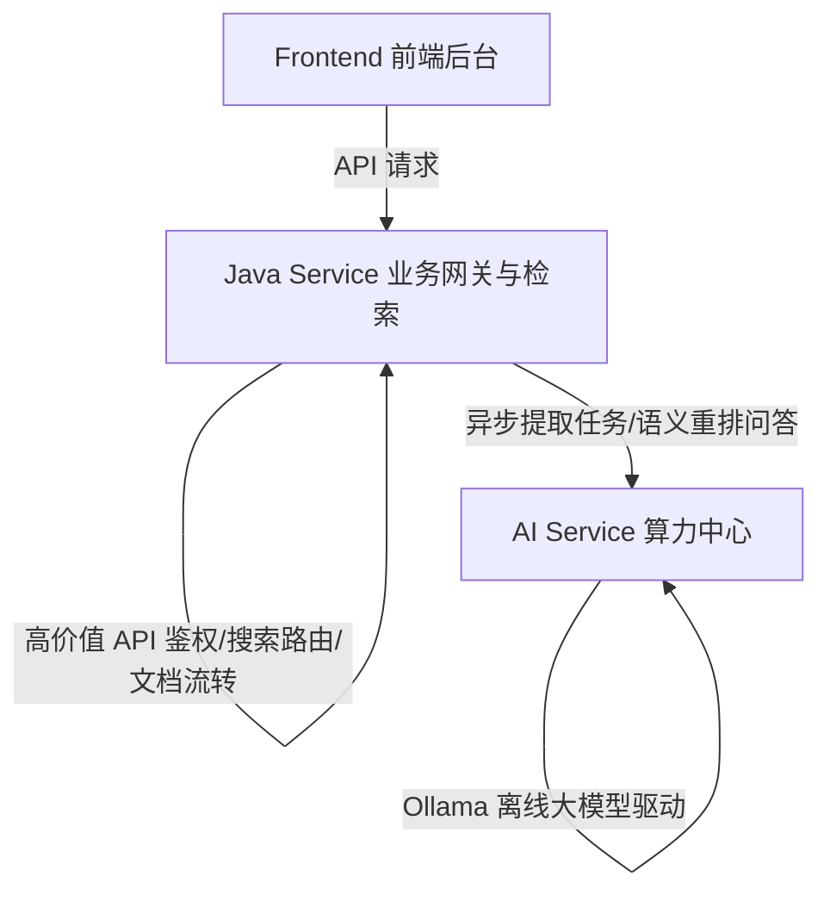

# 🧠 企业级智能知识库检索问答系统 (Knowledge Base Engine)

本项目是一个高并发、多轮对话能力、高安全性的企业级智能知识库检索问答系统（RAG Pipeline）。采用前后端分离以及 Python 离线 AI 算力底座的微服务架构。

---

## 🏗️ 整体系统架构与模块组成

项目由三个核心子系统组成，各自职责清晰，互联互通：



1.  **[Java 后端核心服务 (java_service)](file:///e:/project/AI/knowledge-base/java_service)**
    *   **技术栈**：Spring Boot 3.x, PostgreSQL, Redis, MyBatis-Plus, Flyway, XXL-JOB, Kafka
    *   **核心功能**：高并发搜索与检索、文档元数据流转状态机、高价值 API（JWT 拦截验签）、全自动化审计日志、Kafka 消息消费者（解耦 SFTP 文档传输与对象存储）。
2.  **[Python AI 算力中心 (ai_service)](file:///e:/project/AI/knowledge-base/ai_service)**
    *   **技术栈**：FastAPI, Celery, PaddleOCR, ONNX Runtime (BGE-M3/Reranker), Ollama (Qwen2.5)
    *   **核心功能**：双轨文档智能切片、扫描件 PDF Coordinate-aware 高精 OCRFallback 解析、BGE-M3 混合向量检索、语义重排打分（Reranker）、多轮问答结构化事实抽取与渲染。
3.  **[Vue/Vite 前端后台系统 (frontend)](file:///e:/project/AI/knowledge-base/frontend)**
    *   **技术栈**：Vite, Vue 3, Pinia, Vue Router, TailwindCSS / Vanilla CSS
    *   **核心功能**：高颜值后台管理面板、文档上传与多状态切片追踪、可视化多轮检索问答。

---

## 📂 项目工程目录结构

```text
knowledge-base/
├── java_service/             # Java 业务核心与搜索接口服务
│   ├── src/main/resources/   # 资源与多环境配置文件
│   └── pom.xml               # Maven 依赖定义
├── ai_service/               # Python 离线 AI 服务
│   ├── core/                 # OCR、向量化与 RAG 核心逻辑
│   ├── .env.example          # AI 服务配置模板
│   └── requirements.txt      # Python 依赖项
├── frontend/                 # Vite 开发的高颜值后台管理系统
│   ├── src/                  # 前端核心源码
│   └── package.json          # Node 依赖与脚本
├── models/                   # 本地 AI 模型资产目录（大体积，Git 忽略）
├── docs/                     # 系统设计及部署说明文档
└── docker-compose.yml        # 本地微服务基础设施一键编排
```

---

## 🔒 Git 托管开发与协同规范

为了在 Git 托管时保障项目的**安全性**、**整洁度**和**跨平台一致性**，所有参与开发的成员必须严格遵守以下规范：

### 1. 严格禁止明文密码上传
*   **开发环境 (`application-dev.yml` & `.env`)**：本地开发允许使用默认低风险密码，但应尽量使用环境变量覆盖。
*   **生产环境 (`application-prod.yml`)**：所有的敏感基础设施账号（PostgreSQL、Redis、MinIO、Elasticsearch）密码**均已参数化**。严禁在生产配置文件中写入任何明文密码默认值。部署时必须通过系统环境变量进行注入。
*   **配置文件模板**：提交新的配置项时，请务必同步更新 [ai_service/.env.example](file:///e:/project/AI/knowledge-base/ai_service/.env.example) 模板，但严禁将包含真实密码的 `.env` 提交至 Git。

### 2. 垃圾文件与临时数据隔离
*   本地联调时产生的 `*.json` 调试输出、个人编写的 `test_*.py` 临时性能测试脚本、以及部署打包产生的 `*.tar` 镜像文件（如高达 2.29GB 的 `ai-service.tar`）**均已在 `.gitignore` 中被深度忽略**。
*   如果编写了临时性的实验性代码，建议统一存放在 `scratch/` 目录下，该目录已被 Git 全局忽略。

### 3. 换行符统一策略 (.gitattributes)
*   项目已建立统一的 [根目录 `.gitattributes`](file:///e:/project/AI/knowledge-base/.gitattributes) 配置。
*   所有的代码文件（`.java`, `.py`, `.json`, `.yml`, `.md`）以及 Linux 部署脚本（`.sh`）在提交至 Git 仓库时**一律强制转换为标准 Linux 换行符（LF）**。
*   Windows 专属脚本（`.bat`, `.ps1`）强制保持 `CRLF`。
*   **提示**：在 Windows 上进行开发时，Git 会智能在拉取时为你转换为 CRLF，提交时再转换回 LF，无需人工干预。请勿手动修改编辑器的行尾序列转换器。
