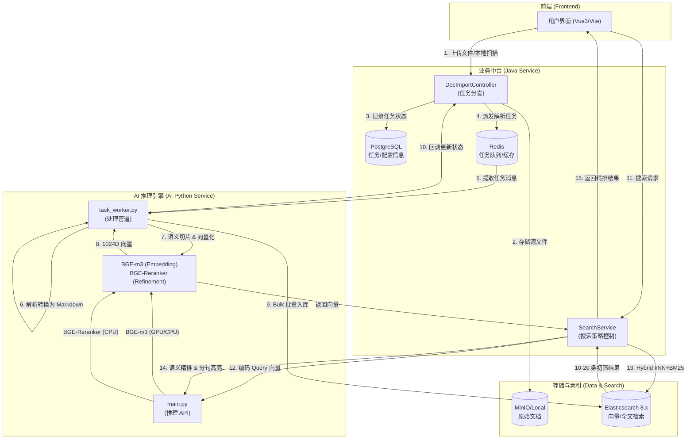

# 知识库 AI 系统架构与数据流向分析 (v6.0)

本系统是一个典型的 RAG (Retrieval-Augmented Generation) 架构，通过 Java (Spring Boot) 提供业务协同与任务调度，Python (FastAPI + Worker) 提供深度推理与数据处理能力。

## 1. 全链路数据流向图 (Mermaid)

---

## 2. 核心环节技术细节解析

### 2.1 数据导入阶段 (Data Ingestion)
*   **接入方式**: 支持 `HTTP Upload`、`URL Download`、`SFTP`、`Local Directory`。
*   **任务编排**: 使用 Redis 列表 (`DOC_TASK_QUEUE`) 实现生产者-消费者模式，保证高并发上传时不阻塞 Java 主进程。

### 2.2 数据处理阶段 (Processing Pipeline)
*   **文件解析**: 采用 **Microsoft MarkItDown** 库。
    *   *技术优势*: 自动识别 PDF、Word、PPT 等格式并统一转换为 **Markdown**，保留标题层级信息。
*   **语义切片 (Chunking)**: 采用 **MarkdownTextSplitter** (LangChain)。
    *   *策略*: `chunk_size=800`，`chunk_overlap=100`。按标题和段落截断，避免截断关键信息。
*   **向量化 (Embedding)**: 使用 **BGE-m3** 模型。
    *   *特性*: 生成 1024 维密集向量。
    *   *加速*: 采用 **ONNX Runtime + DirectML** (GPU) 混合加速，确保响应在毫秒级。

### 2.3 数据存储阶段 (Storage)
*   **索引引擎**: Elasticsearch 8.6.2。
*   **算分引擎**: HNSW (Hierarchical Navigable Small World) 近似近邻算法。
*   **字段定义**:
    *   `content`: 原始切片文本。
    *   `vector`: 向量表示 (Dense Vector)。
    *   `metadata`: 包含源文件名、安全等级、数据源等业务元数据。

### 2.4 数据检索阶段 (Query & Retrieval)
这是 v6.0 深度优化的核心：
1.  **混合搜索 (Hybrid Search)**: 同时发起 `kNN` (向量查找) 和 `Match` (关键词查找)，通过 **RRF (Reciprocal Rank Fusion)** 算法融合得分，既保证语义覆盖，又保证关键词精确度。
2.  **跨编码精排 (Cross-Encoder Rerank)**: 使用 **BGE-Reranker** 模型。
    *   *作用*: 对初筛后的文档进行“深度对齐”算分，剔除表象相关但语义无关的结果。
3.  **语义高亮 (Semantic Highlighting)**:
    *   *传统模式*: 基于关键词正则替换（已废弃）。
    *   *v6.0 模式*: 将 Top 文档分句，调用 `/api/ai/rerank/sentences` 接口。**由 AI 计算每句话与搜索意图的相关性**，提取分值最高的句子。完全不依赖字面匹配，即使搜“结婚”也能自动高亮“成婚已满两年”所在的片段。

---

## 3. 技术栈汇总 (Tech Stack)

| 环节 | 技术/模型 | 备注 |
| :--- | :--- | :--- |
| **前端** | Vue 3 + Vite + Axios | 设计遵循 Google 100 基准 (v6.0) |
| **后端** | Spring Boot 2.7 + MyBatis Plus | 负责业务流转与权限控制 |
| **消息/缓存** | Redis | 任务队列与高性能拦截配置存储 |
| **对象存储** | MinIO / Local File | 原始文档源存储 |
| **搜索引擎** | Elasticsearch 8.x | 向量检索与 RRF 融合 |
| **AI 框架** | FastAPI + ONNX Runtime | 推理 API 封装与硬件加速管理 |
| **向量模型** | **BGE-m3** | 1024 维特征提取 |
| **重排模型** | **BGE-Reranker** | 深度语义算分与高亮提取 |
| **解析引擎** | MarkItDown | 统一转 Markdown |
