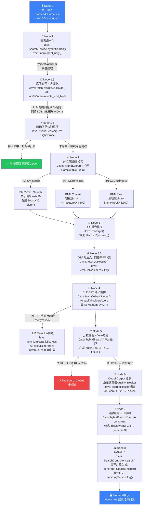
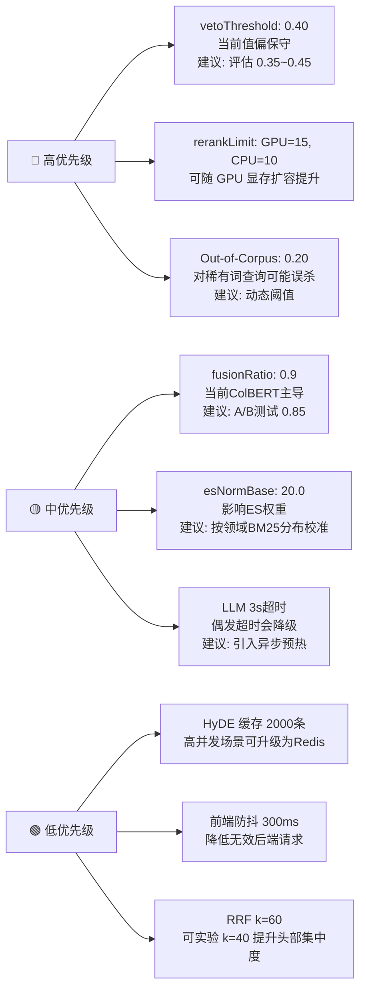

# 知识库项目 — 完整数据流向分析报告

## 一、系统架构概览

```
┌─────────────┐     HTTP/REST      ┌──────────────────────────┐     HTTP/REST     ┌────────────────────────────┐
│  Frontend   │ ─────────────────▶ │   Java Service           │ ────────────────▶ │   AI Service (Python)      │
│  Vue 3      │ ◀───────────────── │   Spring Boot 3          │ ◀──────────────── │   FastAPI + BGE-M3 + Ollama│
│  Port:5173  │                    │   Port:8080              │                   │   Port:8001                │
└─────────────┘                    └────────────┬─────────────┘                   └────────────────────────────┘
                                                │
                                                │ Elasticsearch Java Client
                                                ▼
                                   ┌────────────────────────┐    ┌────────────────┐
                                   │  Elasticsearch 8.11    │    │  MySQL / SQLite│
                                   │  BM25 + HNSW (KNN)     │    │  配置/日志/QA对│
                                   └────────────────────────┘    └────────────────┘
```

---

## 二、完整数据流向图



---

## 三、各节点技术/算法 + 代码位置 + 调优建议

### Node 0 — 用户输入层

| 项目 | 详情 |
|------|------|
| **技术栈** | Vue 3 + Vite, Axios HTTP Client |
| **代码位置** | [frontend/src/views/Home.vue](file:///e:/project/AI/knowledge-base/frontend/src/views/Home.vue) → `searchDocuments()` |
| **入参** | `queryText`, `topK`, `filters.data_source` |
| **调优方向** | 增加前端防抖 (debounce 300ms)，避免用户输入过程中频繁触发后端；缓存最近 10 条搜索结果本地化，提升二次搜索体验 |

---

### Node 1 — 查询归一化

| 项目 | 详情 |
|------|------|
| **技术栈** | Python opencc (繁简转换), pypinyin (拼音提取) |
| **算法** | Unicode 全角→半角字符映射；t2s OpenCC 繁简字典 |
| **代码位置 (Java)** | `SearchService.normalizeQuery()` L183 → HTTP POST `/api/ai/nlp/normalize` |
| **代码位置 (AI)** | `main.py :: NLPProcessor.normalize()` L48, [get_pinyin()](file:///e:/project/AI/knowledge-base/ai_service/main.py#56-60) L56 |
| **超时策略** | Java 侧 3秒 CompletableFuture 超时降级，回退原始 query |
| **调优方向** | ① 增加同义词词典扩展（"缄默"→"保密"）在此层处理，可减少后续 LLM 负担；② pypinyin 字典预热已实现，可进一步加载用户历史查询热词词典 |

---

### Node 1.5 — 意图改写 + HyDE 向量化（合并接口）

| 项目 | 详情 |
|------|------|
| **技术栈** | Ollama (qwen2.5:7b), BGE-M3 (BAAI/bge-m3) |
| **算法** | Few-Shot LLM 关键词提取；BGE-M3 Asymmetric 检索指令前缀（≤15字不加前缀） |
| **代码位置 (Java)** | `SearchService.fetchRewriteAndHyde()` L134 → HTTP POST `/api/ai/intent/rewrite_and_hyde` |
| **代码位置 (AI)** | `main.py :: rewrite_and_hyde()` L672 |
| **关键设计** | 旧链路：LLM先生成假设文档(8-15s)→BGE编码；新链路：BGE直接编码原始query(~400ms)，LLM仅提取BM25关键词(3s超时) |
| **缓存** | `_rewrite_hyde_cache` dict (LRU 2000条) |
| **调优方向** | ① LLM 关键词提取超时现为 3s，可考虑引入流式输出提前终止；② 口语→政务词映射表现已内置 system_prompt，可外化为可配置词典热更新；③ BGE-M3 指令前缀阈值（15字）可根据业务调整 |

---

### Node 1.6 — 精确匹配快速路径（Pre-Flight Probe）

| 项目 | 详情 |
|------|------|
| **技术栈** | Elasticsearch 8.11 bool query |
| **算法** | `matchPhrase(slop=3)` + `term(keyword)` — 标题/文号精确匹配 |
| **代码位置** | `SearchService.hybridSearch()` L424-L482 |
| **命中逻辑** | 匹配 `metadata.source`、`metadata.doc_id`、`metadata.document_number` |
| **性能** | 超时 200ms，命中时完全绕过 AI 引擎，返回匹配度 0.999 |
| **调优方向** | 扩展 Pre-Flight 匹配字段（如 `metadata.tags.keyword`）；对高频查询建立精确索引热缓存 |

---

### Node 2 — 并行三路 Elasticsearch 检索

| 项目 | 详情 |
|------|------|
| **技术栈** | Elasticsearch 8.11, Java CompletableFuture |
| **算法** | **BM25 (Okapi BM25)** + **HNSW (层次化可导航小世界图)** |

#### 路径 A — BM25 文本检索

| 子项 | 详情 |
|------|------|
| **代码位置** | [hybridSearch()](file:///e:/project/AI/knowledge-base/java_service/src/main/java/com/boyang/search/service/SearchService.java#349-1305) L513-L603 → `textRequest` |
| **查询策略** | `match(content)` + `matchPhrase(content, slop=3, boost=15)` + `multiMatch(source^20, keywords^15)` |
| **核心词加权** | 核心词 `boost=20`, 短语匹配 `boost=30` — 通过 [extractCoreTerms()](file:///e:/project/AI/knowledge-base/java_service/src/main/java/com/boyang/search/service/SearchService.java#1708-1740) 提取 IDF 最高的词 |
| **过滤** | `metadata.is_latest=true` 版本过滤；`data_source` 租户隔离过滤 |
| **调优方向** | 调整各字段 boost 值；引入 `function_score` 基于文档时效性加权衰减 |

#### 路径 B — KNN 粗粒度向量检索

| 子项 | 详情 |
|------|------|
| **代码位置** | [hybridSearch()](file:///e:/project/AI/knowledge-base/java_service/src/main/java/com/boyang/search/service/SearchService.java#349-1305) L606-L644 → `knnRequest` |
| **算法** | **HNSW** k近邻，`k=max(topK×3,100)`, `numCandidates=500` |
| **向量字段** | `vector` (1024维 float32, BGE-M3 dense embedding) |
| **过滤** | `chunk_granularity=coarse` + 版本过滤 |
| **调优方向** | 调整 `numCandidates`（越大召回越全但越慢）；可实验 `ef_construction` 和 `m` HNSW 索引参数 |

#### 路径 C — KNN 细粒度向量检索

| 子项 | 详情 |
|------|------|
| **代码位置** | [hybridSearch()](file:///e:/project/AI/knowledge-base/java_service/src/main/java/com/boyang/search/service/SearchService.java#349-1305) L658-L686 → `knnFineRequest` |
| **过滤** | `chunk_granularity=fine` — 精细语义片段检索 |

---

### Node 3 — RRF 融合排序

| 项目 | 详情 |
|------|------|
| **技术栈** | Java 纯内存计算 |
| **算法** | **Reciprocal Rank Fusion (RRF)** |
| **公式** | `score_doc = Σ 1 / (k + rank_i)` 其中 `k=60`（默认），三路结果取 union，相同 doc_id 累加 |
| **代码位置** | `SearchService.rrfMerge()` (独立方法) |
| **关键决策** | 合并后按 RRF 分降序，取 top-N 作为后续 Reranker 输入候选池 |
| **调优方向** | ① 调整 k 值（降低 k 强化头部排名差异，增大 k 趋向均衡）；② 为三路检索设置不同权重系数 (Weighted RRF)；③ 调整 `rerankLimit` 控制送入 Reranker 的候选数量 |

---

### Node 3.5 — Q&A 注入 / 口语向量补充

| 项目 | 详情 |
|------|------|
| **代码位置** | `SearchService.fetchQaResults()` (INTENT 模式) / [fetchColloquialResults()](file:///e:/project/AI/knowledge-base/java_service/src/main/java/com/boyang/search/service/SearchService.java#1923-2004) (SLOGAN 模式) |
| **Q&A 算法** | KNN 向量检索 `kb_qa_pairs` 索引 + Bigram 字面过滤（防止语义漂移） |
| **口语算法** | KNN 检索 `colloquial_vector` 字段，专为俚语/比喻性查询设计 |
| **查询分类** | [classifyQuery()](file:///e:/project/AI/knowledge-base/java_service/src/main/java/com/boyang/search/service/SearchService.java#1878-1897) → `QueryType.INTENT` / `QueryType.SLOGAN` |
| **调优方向** | 扩充 Q&A 对数据集；优化 Bigram 过滤阈值（现为任意 Bigram 命中即通过） |

---

### Node 4 — ColBERT 语义重排

| 项目 | 详情 |
|------|------|
| **技术栈** | BGE-M3 `last_hidden_state` (token级向量), NumPy |
| **算法** | **Late Interaction MaxSim** |
| **公式** | `sim_matrix = Q_vecs @ D_vecs.T` [q_len×d_len] → `max(axis=1)` [q_len] → `mean()` → 分数 ∈ [0,1] |
| **代码位置 (Java)** | `SearchService.fetchColbertScores()` L245 → POST `/api/ai/colbert/score` |
| **代码位置 (AI)** | `main.py :: colbert_score()` L319, `model_manager.encode_colbert()` |
| **降级链路** | ColBERT失败 → BGE Cross-Encoder (`model_manager.rerank()`) → LLM Reranker (`qwen2.5:7b`) |
| **性能** | GPU(CUDA/DML): rerankLimit=15, ~200ms; CPU: rerankLimit=10, 最长8s |
| **调优方向** | ① 调整 `vetoThreshold`（当前 0.40）；② GPU模式下可放开 `rerankLimit` 到 20-25；③ 考虑对 Q 向量做长度归一化前的加权（query token 重要性权重） |

---

### Node 4.5 — LLM Reranker（可选降级路径）

| 项目 | 详情 |
|------|------|
| **技术栈** | Ollama, qwen2.5:7b, 批量 Prompt |
| **算法** | 0-10 整数打分，归一化到 [0,1]，`temperature=0.0` 确定性输出 |
| **代码位置 (Java)** | `SearchService.fetchLlmRerankScores()` L282 → POST `/api/ai/llm/rerank` |
| **代码位置 (AI)** | `main.py :: llm_rerank()` L375 |
| **缓存** | `_llm_rerank_cache`：query + 前3篇MD5为key（命中时0ms） |
| **调优方向** | ① `max_tokens=1500` 防止思维链截断，可根据文档数量动态计算；② Prompt 可注入领域专属词汇表提升评分准确性 |

---

### Node 5 — 分数融合 + Veto 过滤

| 项目 | 详情 |
|------|------|
| **算法** | 融合公式：`finalScore = ColBERT×0.9 + ESNorm×0.1` |
| **ES归一化** | `ESNorm = rawEsScore / (rawEsScore + esNormBase)` (esNormBase=20.0) |
| **Veto判断** | ColBERT分 < 0.40 → `finalScore=0.0001`（等效淘汰）|
| **代码位置** | `SearchService.hybridSearch()` L1003-L1113 |
| **调优方向** | ① 调整 `fusionRatio`（当前0.9，可降至0.8为ES特征留更多权重）；② `esNormBase` 越小ES影响越大，可根据领域BM25得分分布校准；③ 超出rerankLimit的文档现惩罚至 `max(0.15, ESNorm×0.3)`，可考虑完全过滤 |

---

### Node 6 — 质量断路器 (Quality Breaker)

| 项目 | 详情 |
|------|------|
| **Out-of-Corpus** | `topScore < 0.20` → 直接返回空列表（语料库外查询） |
| **相对阈值过滤** | INTENT 模式: `max(topScore×0.20, 0.18)`；SLOGAN 模式: `max(topScore×0.90, 0.18)`；Q&A TOP: `max(topScore×0.70, 0.60)` |
| **代码位置** | `SearchService.hybridSearch()` L1139-L1189 |
| **调优方向** | ① Out-of-Corpus 阈值 0.20 可结合历史查询数据统计最优切割点；② SLOGAN 90% 相对阈值较严格，可实验调整为 85% |

---

### Node 7 — 分数压缩 + UI 映射

| 项目 | 详情 |
|------|------|
| **算法** | 幂次压缩：`display = raw^1.8`，截断到 [0.05, 0.99] |
| **代码位置** | `SearchService.hybridSearch()` L1192-L1200 |
| **目的** | 防止高分文档得分过于集中，拉开差距，提升用户感知区分度 |
| **调优方向** | 指数 1.8 可以调整：>1 拉开差距，<1 趋于均衡；可引入 `truthful_ui_ceiling`/`truthful_ui_max_score_limit` 配置项（DB已有字段）实现运营侧实时调控 |

---

### Node 8 — 结果输出 + 审计

| 项目 | 详情 |
|------|------|
| **代码位置** | `SearchController.search()` → `SearchService.hybridSearch()` 返回值 |
| **高亮生成** | [generateFallbackSnippet()](file:///e:/project/AI/knowledge-base/java_service/src/main/java/com/boyang/search/service/SearchService.java#1324-1382) + [highlightText()](file:///e:/project/AI/knowledge-base/java_service/src/main/java/com/boyang/search/service/SearchService.java#1542-1566) — 句子切分 + 关键词高亮 `<em>` 标签 |
| **审计** | `SearchAuditLogService.log()` 记录查询词、耗时、命中数 |
| **调优方向** | 高亮片段生成可引入 BM25 句子级评分选择最佳片段（当前为简单窗口截取）；审计日志可接入 ELK 可观测性平台 |

---

## 四、全局调优总结



| 参数 | 当前值 | 配置位置 | 调优建议 |
|------|--------|----------|----------|
| `vetoThreshold` (ColBERT) | 0.40 | [SearchService.java](file:///e:/project/AI/knowledge-base/java_service/src/main/java/com/boyang/search/service/SearchService.java) L1054 | 降至 0.35 减少误杀 |
| `rerankLimit` | GPU=15, CPU=10 | `sys_ai_tuning_config` DB | GPU 场景可升至 20 |
| `fusionRatio` | 0.9 | [SearchService.java](file:///e:/project/AI/knowledge-base/java_service/src/main/java/com/boyang/search/service/SearchService.java) L1014 | A/B 实验 0.85 |
| `esNormBase` | 20.0 | `sys_ai_tuning_config` DB | 根据 ES 评分分布校准 |
| `SLOGAN 相对阈值` | topScore×0.90 | [SearchService.java](file:///e:/project/AI/knowledge-base/java_service/src/main/java/com/boyang/search/service/SearchService.java) L1172 | 可降至 0.85 |
| `numCandidates` (KNN) | 500 | [SearchService.java](file:///e:/project/AI/knowledge-base/java_service/src/main/java/com/boyang/search/service/SearchService.java) L614 | 内存充足时升至 800 |
| `Out-of-Corpus阈值` | 0.20 | [SearchService.java](file:///e:/project/AI/knowledge-base/java_service/src/main/java/com/boyang/search/service/SearchService.java) L1147 | 引入动态算法 |
