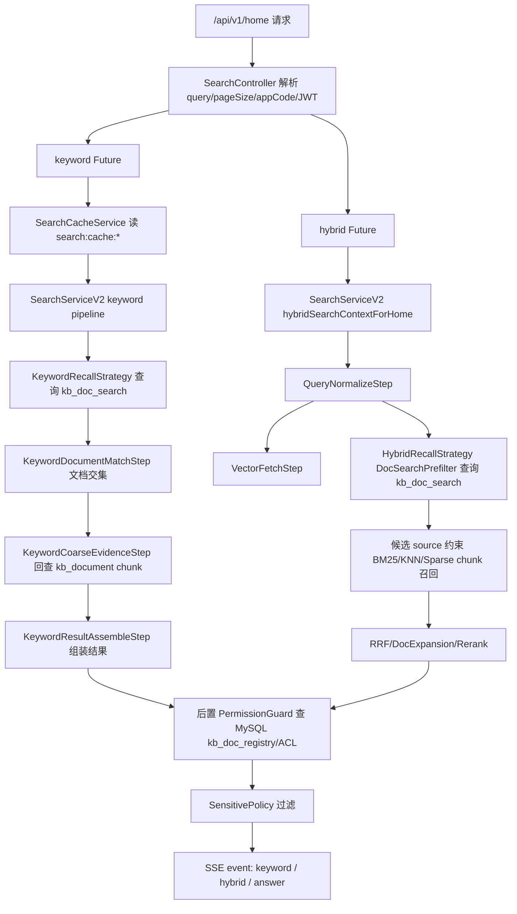
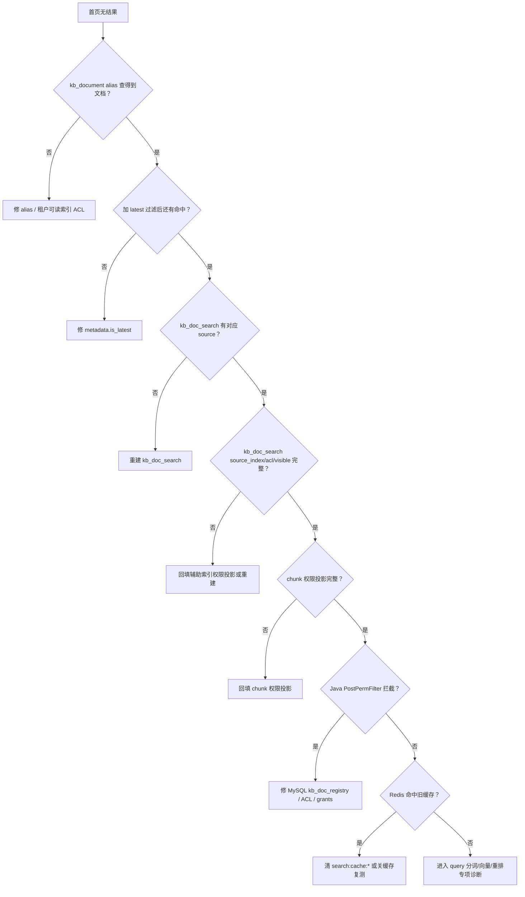

# /home 首页检索离线索引替换诊断与修复 Runbook

## 1. 适用场景

本文用于诊断以下问题：

- 离线环境完成 ES 索引替换后，`/api/v1/home` 或首页 SSE 检索没有返回内容。
- ES 中能直接看到对应文档，但 Java 首页检索结果为空。
- 替换了 `kb_document*` 主索引，但不确定 `kb_doc_search`、权限投影、别名、MySQL 注册表是否同步。

核心判断原则：

> “ES 有文档”只是检索成功的必要条件。首页检索必须同时满足读别名、文档级预筛、chunk 主索引、权限投影、`is_latest`、MySQL 后置权限与缓存状态都一致。

## 2. 首页检索全链路

`/home` 首页检索不是单次 ES 查询，实际会并行产生多条链路。



关键代码入口：

- `java_service/src/main/java/com/boyang/search/controller/SearchController.java`
  - 首页 keyword：`supplySearchForHome(...)`
  - 首页 hybrid：`hybridSearchContextForHome(...)`
- `java_service/src/main/java/com/boyang/search/service/SearchServiceV2.java`
  - 解析可读索引：`SearchIndexResolver.resolve(...)`
  - 后置权限：`applyPostPermissionFilter(...)`
- `java_service/src/main/java/com/boyang/search/pipeline/steps/KeywordRecallStrategy.java`
  - keyword 优先查 `kb_doc_search`
  - `SEARCH_KEYWORD_LEGACY_FALLBACK_ENABLED=false` 时，`kb_doc_search` 无交集不会回退全局 chunk
- `java_service/src/main/java/com/boyang/search/pipeline/steps/HybridRecallStrategy.java`
  - 首页 hybrid 默认使用 `kb_doc_search` 预筛
  - 预筛为空时，默认不跑全局 chunk 召回
- `java_service/src/main/java/com/boyang/search/pipeline/steps/EsRecallUtils.java`
  - ES 前置权限过滤
  - `source_index` 过滤
  - `visible_unit_codes` 过滤

## 3. 快速分流结论表

先按下面顺序判断，能最快定位大类根因。

| 检查点 | 现象 | 大概率根因 | 修复方向 |
| --- | --- | --- | --- |
| `kb_document` alias 不指向新索引 | 直接查新物理索引有数据，查 `kb_document` 没数据 | 别名未切换 | 重新绑定 `kb_document` 读别名 |
| `kb_doc_search` count 为 0 或无对应 source | chunk 主索引有数据，首页 keyword/hybrid 都空 | 文档级预筛索引未重建 | 执行 `backfill_kb_doc_search.py` |
| `kb_doc_search.source_index` 与新物理索引不一致 | `kb_doc_search` 有文档，但加 `source_index` 过滤后为空 | 辅助索引权限/来源投影未同步 | 重建 `kb_doc_search` 或回填辅助索引投影 |
| `metadata.is_latest=false` | 直接 match 有命中，加 latest 过滤后为空 | 最新版本标记未激活 | 执行 `reconcile_chunk_is_latest.py` 或修正入库流程 |
| `acl_tokens` 缺失或不含当前用户 token | 不带权限过滤有结果，带权限过滤为空 | 权限投影缺失/错误 | 回填 chunk 与辅助索引权限投影 |
| Java 日志 `PostPermFilter` 拦截 | ES 已召回，最终响应为空 | MySQL `kb_doc_registry` / ACL 与 ES 不一致 | 修复 MySQL 注册表或权限快照后同步 ES |
| Redis 有旧空缓存 | 修复 ES 后短时间仍空 | 首页 keyword 缓存命中旧结果 | 删除 `search:cache:*` 或等待 TTL |

## 4. 执行前准备

### 4.1 设置环境变量

PowerShell：

```powershell
$env:ES_HOST = "http://localhost:9200"
$env:ES_USER = ""
$env:ES_PASS = ""
$env:SOURCE_INDEX = "kb_document_*"
$env:KB_DOC_SEARCH_READ_ALIAS = "kb_doc_search"
$env:KB_DOC_SEARCH_INDEX = "kb_doc_search_v1"
```

Linux shell：

```bash
export ES_HOST="http://localhost:9200"
export ES_USER=""
export ES_PASS=""
export SOURCE_INDEX="kb_document_*"
export KB_DOC_SEARCH_READ_ALIAS="kb_doc_search"
export KB_DOC_SEARCH_INDEX="kb_doc_search_v1"
```

如果 ES 使用 Basic Auth，填入 `ES_USER` / `ES_PASS`。

### 4.2 记录本次排障对象

排障时必须明确这四个值：

| 名称 | 示例 | 用途 |
| --- | --- | --- |
| 查询词 | `晋升 通知` | 复现首页检索 |
| 文档 source | `某某通知.docx` | 串联 `kb_document`、`kb_doc_search`、MySQL |
| 当前用户 userId | `u001` | 校验后置权限 |
| 当前用户 deptCode | `620102000000` | 校验 DEPT 可见范围 |

后文命令使用占位符：

- `<QUERY>`：查询词
- `<SOURCE>`：文档 source / 文件名
- `<USER_ID>`：当前用户 ID
- `<DEPT_CODE>`：当前用户部门编码
- `<NEW_INDEX>`：替换后的物理索引名

## 5. 第一层：确认 ES 服务与读别名

### 5.1 查 ES 是否可达

查什么：ES 服务是否可访问。

为什么查：Java 与脚本默认都依赖 `ES_HOST`，连不上时后续判断没有意义。

```powershell
Invoke-RestMethod "$env:ES_HOST/" | ConvertTo-Json -Depth 5
```

正常结果：

- 返回 ES 集群信息。

异常结果：

- 连接失败：先修 ES 地址、端口、容器网络、认证。

### 5.2 查主读别名 `kb_document`

查什么：`kb_document` 是否指向替换后的物理索引。

```powershell
Invoke-RestMethod "$env:ES_HOST/_cat/aliases/kb_document?v" | Out-String
```

正常结果：

- `kb_document` 至少指向 `<NEW_INDEX>`。
- 如果处于迁移并读期，可指向多个 `kb_document_*` 物理索引。

异常结果与修复：

| 结果 | 判断 | 修复 |
| --- | --- | --- |
| 404 或空 | 没有读别名 | 绑定 `kb_document` 到新索引 |
| 指向旧索引 | Java 实际查旧数据 | 切换 alias 到新索引 |
| 指向多个索引但新索引无权限 | 角色索引 ACL 可能过滤 | 检查 `kb_index_acl_subject` |

切换 alias 示例。执行前确认旧索引名，避免误删读路径：

```json
POST /_aliases
{
  "actions": [
    { "remove": { "index": "旧物理索引名", "alias": "kb_document" } },
    { "add": { "index": "<NEW_INDEX>", "alias": "kb_document" } }
  ]
}
```

PowerShell：

```powershell
$body = @{
  actions = @(
    @{ remove = @{ index = "旧物理索引名"; alias = "kb_document" } },
    @{ add = @{ index = "<NEW_INDEX>"; alias = "kb_document" } }
  )
} | ConvertTo-Json -Depth 10
Invoke-RestMethod "$env:ES_HOST/_aliases" -Method Post -ContentType "application/json" -Body $body
```

## 6. 第二层：确认主索引可检索

### 6.1 查索引列表与文档量

```powershell
Invoke-RestMethod "$env:ES_HOST/_cat/indices/kb_document*,kb_doc_search*?v&s=index" | Out-String
```

正常结果：

- `<NEW_INDEX>` 有非零 `docs.count`。
- `kb_doc_search_v1` 或当前 `kb_doc_search` 指向的物理索引有非零 `docs.count`。

### 6.2 查 `kb_document` 是否能按 source 命中

```powershell
$body = @{
  size = 5
  _source = @(
    "content",
    "display_content",
    "metadata.source",
    "metadata.doc_id",
    "metadata.title",
    "metadata.is_latest",
    "metadata.doc_version",
    "metadata.acl_tokens",
    "acl_tokens",
    "source_index",
    "index_code",
    "owner_unit_code",
    "visible_unit_codes",
    "permission_version",
    "chunk_granularity"
  )
  query = @{
    bool = @{
      should = @(
        @{ term = @{ "metadata.source" = "<SOURCE>" } },
        @{ match_phrase = @{ "metadata.source" = "<SOURCE>" } }
      )
      minimum_should_match = 1
    }
  }
} | ConvertTo-Json -Depth 20

Invoke-RestMethod "$env:ES_HOST/kb_document/_search" -Method Post -ContentType "application/json" -Body $body |
  ConvertTo-Json -Depth 20
```

正常结果：

- `hits.hits` 非空。
- `_index` 是预期的新索引。
- `metadata.source` 与 `<SOURCE>` 一致。

异常结果：

| 结果 | 判断 | 怎么改 |
| --- | --- | --- |
| 查 `<NEW_INDEX>` 有，查 `kb_document` 无 | alias 未指向新索引 | 修 alias |
| 查 source 无，但 match content 有 | `metadata.source` 缺失或字段名变化 | 修入库字段或重建索引 |
| `_index` 是旧索引 | alias 或租户索引 ACL 未切换 | 修 alias / MySQL index ACL |

### 6.3 查正文是否能按查询词命中

```powershell
$body = @{
  size = 5
  _source = @(
    "content",
    "display_content",
    "metadata.source",
    "metadata.title",
    "metadata.is_latest",
    "metadata.acl_tokens",
    "acl_tokens"
  )
  query = @{
    bool = @{
      should = @(
        @{ match = @{ content = "<QUERY>" } },
        @{ match_phrase = @{ content = "<QUERY>" } },
        @{ match = @{ display_content = "<QUERY>" } },
        @{ match = @{ "metadata.title" = "<QUERY>" } }
      )
      minimum_should_match = 1
    }
  }
} | ConvertTo-Json -Depth 20

Invoke-RestMethod "$env:ES_HOST/kb_document/_search" -Method Post -ContentType "application/json" -Body $body |
  ConvertTo-Json -Depth 20
```

正常结果：

- 有命中，说明主索引至少可被基础文本查询召回。

异常结果：

- 如果只按 source 能查到，按 query 查不到，说明文档存在但可检索字段不包含查询词，需检查解析、分词、`content/display_content/doc_title/metadata.title`。

## 7. 第三层：确认 `is_latest`

首页检索会保留：

- `metadata.is_latest=true`
- 或 `metadata.is_latest` 字段不存在的历史数据

如果字段存在且为 `false`，会被过滤。

### 7.1 查某文档 latest 分布

```powershell
$body = @{
  size = 0
  query = @{ term = @{ "metadata.source" = "<SOURCE>" } }
  aggs = @{
    latest = @{
      terms = @{
        field = "metadata.is_latest"
        missing = "__missing__"
        size = 10
      }
    }
    versions = @{
      terms = @{
        field = "metadata.doc_version"
        size = 20
      }
    }
  }
} | ConvertTo-Json -Depth 20

Invoke-RestMethod "$env:ES_HOST/kb_document/_search" -Method Post -ContentType "application/json" -Body $body |
  ConvertTo-Json -Depth 20
```

正常结果：

- 至少有一批 chunk 为 `metadata.is_latest=true`。
- 或历史数据完全缺失 `metadata.is_latest` 字段。

异常结果：

- 全部是 `false`：首页召回会被过滤为空。

### 7.2 修复 latest 卡死

先 dry-run：

```powershell
python ai_service/scripts/reconcile_chunk_is_latest.py
```

确认输出只包含预期文档后执行：

```powershell
python ai_service/scripts/reconcile_chunk_is_latest.py --apply
```

执行后刷新：

```powershell
Invoke-RestMethod "$env:ES_HOST/kb_document/_refresh" -Method Post | ConvertTo-Json -Depth 5
```

注意：该脚本默认 ES 地址写在脚本内为 `http://localhost:9200`，如离线环境不是本机端口，先改脚本或用同等 DSL 手工执行。不要在生产上盲目全量执行。

## 8. 第四层：确认 `kb_doc_search` 文档级预筛

首页 keyword 和 hybrid 都强依赖 `kb_doc_search`。

### 8.1 查 `kb_doc_search` alias

```powershell
Invoke-RestMethod "$env:ES_HOST/_cat/aliases/kb_doc_search?v" | Out-String
Invoke-RestMethod "$env:ES_HOST/_cat/aliases/kb_doc_search_write?v" | Out-String
```

正常结果：

- `kb_doc_search` 指向当前读索引。
- `kb_doc_search_write` 指向当前写索引，且写入目标明确。

### 8.2 查 `kb_doc_search` 总量

```powershell
Invoke-RestMethod "$env:ES_HOST/kb_doc_search/_count" | ConvertTo-Json -Depth 5
```

正常结果：

- count 接近 `kb_document` 中 latest 文档 source 去重数量。

### 8.3 查对应 source 是否存在

```powershell
$body = @{
  size = 5
  _source = @(
    "source",
    "source_name",
    "title",
    "document_number",
    "doc_terms",
    "summary",
    "is_latest",
    "acl_tokens",
    "visibility",
    "owner_dept_id",
    "source_index",
    "index_code",
    "owner_unit_code",
    "visible_unit_codes",
    "permission_version"
  )
  query = @{
    bool = @{
      should = @(
        @{ term = @{ source = "<SOURCE>" } },
        @{ term = @{ source_name = "<SOURCE>" } },
        @{ match = @{ title = "<SOURCE>" } }
      )
      minimum_should_match = 1
    }
  }
} | ConvertTo-Json -Depth 20

Invoke-RestMethod "$env:ES_HOST/kb_doc_search/_search" -Method Post -ContentType "application/json" -Body $body |
  ConvertTo-Json -Depth 20
```

正常结果：

- 有一条文档级记录。
- `source` 等于主索引 `metadata.source`。
- `is_latest=true` 或字段缺失。
- `source_index` 等于 `<NEW_INDEX>`，或兼容逻辑索引名。
- `acl_tokens`、`visible_unit_codes` 非空。

异常结果与修复：

| 结果 | 判断 | 修复 |
| --- | --- | --- |
| 没有 `<SOURCE>` | 替换主索引后未重建 `kb_doc_search` | 执行 8.5 重建 |
| 有 source，但 `is_latest=false` | 预筛层被 latest 过滤 | 重建 `kb_doc_search` |
| `source_index` 是旧索引 | 新旧主索引与辅助索引未对齐 | 重建或回填辅助投影 |
| `acl_tokens` 缺失 | 权限过滤会 fail-closed | 回填辅助权限投影 |

### 8.4 模拟首页 doc_search 预筛

```powershell
$body = @{
  size = 20
  _source = @("source","title","doc_terms","is_latest","acl_tokens","source_index","visible_unit_codes")
  query = @{
    bool = @{
      should = @(
        @{ term = @{ source = @{ value = "<QUERY>"; boost = 18.0 } } },
        @{ term = @{ document_number = @{ value = "<QUERY>"; boost = 18.0 } } },
        @{ term = @{ "title.keyword" = @{ value = "<QUERY>"; boost = 18.0 } } },
        @{ match = @{ title = @{ query = "<QUERY>"; boost = 10.0 } } },
        @{ match = @{ doc_terms = @{ query = "<QUERY>"; boost = 4.0 } } },
        @{ match_phrase = @{ doc_terms = @{ query = "<QUERY>"; slop = 3; boost = 8.0 } } },
        @{ match = @{ summary = @{ query = "<QUERY>"; boost = 1.5 } } }
      )
      minimum_should_match = 1
      filter = @(
        @{
          bool = @{
            should = @(
              @{ term = @{ is_latest = $true } },
              @{ bool = @{ must_not = @( @{ exists = @{ field = "is_latest" } } ) } }
            )
            minimum_should_match = 1
          }
        }
      )
    }
  }
} | ConvertTo-Json -Depth 30

Invoke-RestMethod "$env:ES_HOST/kb_doc_search/_search" -Method Post -ContentType "application/json" -Body $body |
  ConvertTo-Json -Depth 20
```

如果这一步为空，而主索引能按正文命中，首页 keyword/hybrid 大概率会空。

### 8.5 重建或校验 `kb_doc_search`

先校验：

```powershell
$env:BACKFILL_MODE = "validate"
python ai_service/scripts/backfill_kb_doc_search.py
```

如果 validate 报 count mismatch、字段缺失或重复 source，先 dry-run：

```powershell
$env:BACKFILL_MODE = "reconcile"
$env:DRY_RUN = "true"
$env:SOURCE_INDEX = "kb_document"
python ai_service/scripts/backfill_kb_doc_search.py
```

确认缺失/修复对象正确后执行：

```powershell
$env:BACKFILL_MODE = "reconcile"
$env:DRY_RUN = "false"
$env:SOURCE_INDEX = "kb_document"
python ai_service/scripts/backfill_kb_doc_search.py
```

全量重建时：

```powershell
$env:BACKFILL_MODE = "full"
$env:DRY_RUN = "false"
$env:SOURCE_INDEX = "kb_document"
python ai_service/scripts/backfill_kb_doc_search.py
```

执行后再次 validate：

```powershell
$env:BACKFILL_MODE = "validate"
python ai_service/scripts/backfill_kb_doc_search.py
```

判断标准：

- `kb_document* unique sources` 与 `kb_doc_search documents` 基本一致。
- `doc_id/content_hash/source` 无缺失。
- `source_index` 与替换后的主索引范围一致。

## 9. 第五层：确认权限投影

### 9.1 查 chunk 权限字段缺失量

```powershell
$body = @{
  query = @{
    bool = @{
      should = @(
        @{ bool = @{ must_not = @( @{ exists = @{ field = "acl_tokens" } } ) } },
        @{ bool = @{ must_not = @( @{ exists = @{ field = "source_index" } } ) } },
        @{ bool = @{ must_not = @( @{ exists = @{ field = "visible_unit_codes" } } ) } },
        @{ bool = @{ must_not = @( @{ exists = @{ field = "permission_version" } } ) } }
      )
      minimum_should_match = 1
    }
  }
} | ConvertTo-Json -Depth 20

Invoke-RestMethod "$env:ES_HOST/kb_document/_count" -Method Post -ContentType "application/json" -Body $body |
  ConvertTo-Json -Depth 5
```

正常结果：

- count 为 0，或只剩明确不参与检索的历史数据。

异常结果：

- count 很大：ES 前置权限可能直接过滤掉文档。

### 9.2 查某文档权限字段

```powershell
$body = @{
  size = 5
  _source = @(
    "metadata.source",
    "metadata.visibility",
    "metadata.acl_tokens",
    "acl_tokens",
    "source_index",
    "index_code",
    "owner_unit_code",
    "visible_unit_codes",
    "permission_version"
  )
  query = @{ term = @{ "metadata.source" = "<SOURCE>" } }
} | ConvertTo-Json -Depth 20

Invoke-RestMethod "$env:ES_HOST/kb_document/_search" -Method Post -ContentType "application/json" -Body $body |
  ConvertTo-Json -Depth 20
```

正常结果：

- `acl_tokens` 非空。
- `visible_unit_codes` 至少包含 `global` 或当前用户部门可见范围。
- `source_index` 是真实物理索引。
- `permission_version` 非空。

### 9.3 回填 chunk 权限投影

先 dry-run 抽样：

```powershell
python ai_service/scripts/backfill_document_permission_projection.py --index kb_document --limit 100 --sample 20
```

如果样例字段正确，正式执行：

```powershell
python ai_service/scripts/backfill_document_permission_projection.py --index kb_document --batch-size 500 --execute
```

如需指定 PG：

```powershell
python ai_service/scripts/backfill_document_permission_projection.py `
  --index kb_document `
  --pg-dsn "host=127.0.0.1 port=5432 dbname=knowledge_base user=postgres password=你的密码 connect_timeout=3" `
  --batch-size 500 `
  --execute
```

如果离线环境没有 PG 或 PG 不可信：

```powershell
python ai_service/scripts/backfill_document_permission_projection.py `
  --index kb_document `
  --no-pg `
  --default-owner global `
  --batch-size 500 `
  --execute
```

风险说明：

- `--no-pg --default-owner global` 会用保守默认单位补齐，适合临时恢复检索，不应替代真实权限同步。
- 如果文档本应 PRIVATE/GRANT，但 ACL 无法证明，脚本会尽量 fail-closed，可能仍不返回。

### 9.4 回填辅助索引权限投影

`kb_doc_search`、`kb_doc_meta` 也必须有 `source_index` / `visible_unit_codes`。

先 dry-run：

```powershell
python ai_service/scripts/backfill_auxiliary_permission_projection.py `
  --indexes kb_doc_search,kb_doc_meta `
  --chunk-index kb_document `
  --limit 100 `
  --sample 20
```

正式执行：

```powershell
python ai_service/scripts/backfill_auxiliary_permission_projection.py `
  --indexes kb_doc_search,kb_doc_meta `
  --chunk-index kb_document `
  --batch-size 200 `
  --execute
```

执行后检查：

```powershell
$body = @{
  query = @{
    bool = @{
      should = @(
        @{ bool = @{ must_not = @( @{ exists = @{ field = "source_index" } } ) } },
        @{ bool = @{ must_not = @( @{ exists = @{ field = "visible_unit_codes" } } ) } }
      )
      minimum_should_match = 1
    }
  }
} | ConvertTo-Json -Depth 20

Invoke-RestMethod "$env:ES_HOST/kb_doc_search/_count" -Method Post -ContentType "application/json" -Body $body |
  ConvertTo-Json -Depth 5
```

## 10. 第六层：确认 `source_index` 与可读索引范围

首页检索会把 `SearchIndexResolver` 得到的可读主索引范围，下推到 `kb_doc_search.source_index`。

### 10.1 查 `kb_doc_search.source_index` 分布

```powershell
$body = @{
  size = 0
  aggs = @{
    source_index = @{
      terms = @{
        field = "source_index"
        missing = "__missing__"
        size = 50
      }
    }
  }
} | ConvertTo-Json -Depth 20

Invoke-RestMethod "$env:ES_HOST/kb_doc_search/_search" -Method Post -ContentType "application/json" -Body $body |
  ConvertTo-Json -Depth 20
```

正常结果：

- 主体 bucket 是 `<NEW_INDEX>` 或逻辑索引名，例如 `kb_document_official`。

异常结果：

- 仍是旧索引：重建 `kb_doc_search`。
- 大量 `__missing__`：执行辅助索引权限投影回填，或临时打开兼容开关。

### 10.2 临时兼容开关

仅用于排障确认，不建议长期打开：

```powershell
$env:KB_SEARCH_DOC_SEARCH_MISSING_SOURCE_INDEX_ALLOW = "true"
$env:KB_SEARCH_LEGACY_MISSING_PERMISSION_ALLOW = "true"
```

判断：

- 打开后有结果，说明确实是历史字段缺失导致。
- 修复方案应是补齐 `source_index` / 权限投影，而不是长期放宽。

## 11. 第七层：确认 MySQL 后置权限

即使 ES 已召回，`SearchServiceV2` 末端还会通过 `PermissionGuard` 查 MySQL。

### 11.1 查 Java 日志

重点搜索：

```text
[PostPermFilter]
[PermGuard]
文档不存在或已删除
ACL 策略拒绝访问
postFilterDeniedCount
```

如果日志中出现：

```text
[PostPermFilter] 幽灵文档已被后置过滤 guardKey='xxx'
```

说明 ES 已召回，但 MySQL 权限权威源拒绝了。

### 11.2 查 MySQL 注册表

按实际数据库执行：

```sql
select
  doc_id,
  source_name,
  doc_version,
  status,
  visibility,
  dept_code,
  uploader_id,
  update_time
from kb_doc_registry
where source_name = '<SOURCE>'
order by doc_version desc;
```

正常结果：

- 有最新记录。
- `status` 不是 `DELETED`。
- `visibility` 与业务预期一致。
- `dept_code` / `uploader_id` 非空或符合权限类型要求。

异常结果与修复：

| 结果 | 判断 | 修复 |
| --- | --- | --- |
| 无记录 | 后置权限认为文档不存在 | 补写 `kb_doc_registry` 或重新走入库注册 |
| status=DELETED | 后置权限拒绝 | 恢复 registry 状态或清理 ES 幽灵文档 |
| visibility=PRIVATE 且非上传人 | 当前用户无权 | 用正确用户验证或修权限 |
| DEPT 但 dept_code 缺失 | 无法判定部门权限 | 补齐 dept_code |
| GRANT 无授权 | MySQL grant 表未同步 | 补齐 `kb_doc_grants` |

### 11.3 用 MySQL 权限快照覆盖 ES

如果 MySQL 是权威源，先导出 JSONL，格式示例：

```json
{"source_name":"a.docx","target_index":"kb_document_official_v2","acl_tokens":["_INTERNAL"],"owner_unit_code":"global","visible_unit_codes":["global"],"permission_version":1783520000000}
```

dry-run：

```powershell
python ai_service/scripts/apply_mysql_permission_snapshot.py `
  --input scratch/permission_snapshot.jsonl `
  --chunk-index kb_document `
  --aux-indexes kb_doc_meta_v2,kb_doc_search_v1,kb_qa_pairs_v2 `
  --limit 100 `
  --sample 20
```

正式执行：

```powershell
python ai_service/scripts/apply_mysql_permission_snapshot.py `
  --input scratch/permission_snapshot.jsonl `
  --chunk-index kb_document `
  --aux-indexes kb_doc_meta_v2,kb_doc_search_v1,kb_qa_pairs_v2 `
  --execute `
  --output scratch/apply_permission_report.json
```

## 12. 第八层：确认 Redis 首页缓存

首页 keyword 复用 `SearchCacheService`，key 前缀为：

```text
search:cache:
```

TTL 默认 300 秒。

### 12.1 临时关闭首页缓存复测

启动 Java 前设置：

```powershell
$env:SEARCH_HOME_CACHE_ENABLED = "false"
```

如果关闭缓存后恢复，说明旧缓存参与了问题。

### 12.2 删除搜索缓存

谨慎执行。离线环境可直接清理搜索缓存：

```powershell
redis-cli --scan --pattern "search:cache:*" | ForEach-Object { redis-cli DEL $_ }
```

如果 PowerShell 管道不可用，用 Redis CLI 分批处理，避免生产使用 `KEYS search:cache:*`。

## 13. 第九层：复现首页 SSE

首页接口通常返回 SSE 事件，至少关注：

- `keyword`
- `hybrid`
- `qa_stage`
- `error`

### 13.1 用 curl 复现

按实际接口 body 调整：

```bash
curl -N -X POST "http://localhost:8080/api/v1/home" \
  -H "Content-Type: application/json" \
  -H "Authorization: Bearer <TOKEN>" \
  -H "X-Search-AppCode: <APP_CODE>" \
  -d '{
    "queryText": "<QUERY>",
    "pageSize": 10,
    "pageNum": 1,
    "searchMode": "hybrid",
    "filters": {}
  }'
```

判断：

| SSE 事件 | 结果 | 含义 |
| --- | --- | --- |
| `keyword` 空，`hybrid` 空 | 预筛/权限/alias 大概率有问题 |
| `keyword` 有，`hybrid` 空 | 向量、预筛后 chunk 召回、rerank 侧问题 |
| `keyword` 空，`hybrid` 有 | `kb_doc_search` keyword 字段或多词交集问题 |
| `error` | 看 Java 栈、AI 服务、ES 异常 |

## 14. 修复路径决策树



## 15. 推荐完整修复顺序

当离线环境刚完成索引替换，建议按以下顺序做，不要只修一个点：

1. 切换 `kb_document` alias 到新物理索引。
2. 刷新主索引：

```powershell
Invoke-RestMethod "$env:ES_HOST/kb_document/_refresh" -Method Post | ConvertTo-Json -Depth 5
```

3. 检查并修复 `metadata.is_latest`。
4. 回填 chunk 权限投影：

```powershell
python ai_service/scripts/backfill_document_permission_projection.py --index kb_document --batch-size 500 --execute
```

5. 重建或 reconcile `kb_doc_search`：

```powershell
$env:BACKFILL_MODE = "reconcile"
$env:DRY_RUN = "false"
$env:SOURCE_INDEX = "kb_document"
python ai_service/scripts/backfill_kb_doc_search.py
```

6. 回填辅助索引权限投影：

```powershell
python ai_service/scripts/backfill_auxiliary_permission_projection.py `
  --indexes kb_doc_search,kb_doc_meta `
  --chunk-index kb_document `
  --execute
```

7. 校验 `kb_doc_search`：

```powershell
$env:BACKFILL_MODE = "validate"
python ai_service/scripts/backfill_kb_doc_search.py
```

8. 清理 Redis 搜索缓存或等待 300 秒 TTL。
9. 用 `/home` SSE 复测。

## 16. 验收清单

修复完成后，必须全部满足：

- [ ] `GET /_cat/aliases/kb_document?v` 指向新索引。
- [ ] `GET /kb_document/_count` 非零。
- [ ] 按 `<SOURCE>` 查 `kb_document` 有命中。
- [ ] 按 `<QUERY>` 查 `kb_document` 有命中。
- [ ] `metadata.is_latest=true` 的 chunk 存在，或历史数据缺失该字段。
- [ ] `GET /kb_doc_search/_count` 非零。
- [ ] 按 `<SOURCE>` 查 `kb_doc_search` 有文档级记录。
- [ ] `kb_doc_search.source_index` 与新索引或逻辑索引名一致。
- [ ] `kb_doc_search.acl_tokens` 非空。
- [ ] `kb_doc_search.visible_unit_codes` 非空。
- [ ] chunk 主索引 `acl_tokens/source_index/visible_unit_codes/permission_version` 基本完整。
- [ ] MySQL `kb_doc_registry` 有 `<SOURCE>` 最新记录，且非 `DELETED`。
- [ ] Java 日志没有 `PostPermFilter` 大量拦截该文档。
- [ ] Redis 旧缓存已清理或已过期。
- [ ] `/home` SSE 的 `keyword` 或 `hybrid` 至少一个事件返回非空结果。

## 17. 附录：最小可复制诊断脚本

将下面保存为临时 PowerShell 片段执行，替换前三个变量即可。

```powershell
$ES = "http://localhost:9200"
$QUERY = "<QUERY>"
$SOURCE = "<SOURCE>"

Write-Host "== ES =="
Invoke-RestMethod "$ES/" | ConvertTo-Json -Depth 5

Write-Host "== aliases =="
Invoke-RestMethod "$ES/_cat/aliases/kb_document?v" | Out-String
Invoke-RestMethod "$ES/_cat/aliases/kb_doc_search?v" | Out-String

Write-Host "== indices =="
Invoke-RestMethod "$ES/_cat/indices/kb_document*,kb_doc_search*?v&s=index" | Out-String

Write-Host "== kb_document count =="
Invoke-RestMethod "$ES/kb_document/_count" | ConvertTo-Json -Depth 5

Write-Host "== kb_doc_search count =="
Invoke-RestMethod "$ES/kb_doc_search/_count" | ConvertTo-Json -Depth 5

Write-Host "== source in kb_document =="
$docBySource = @{
  size = 3
  _source = @("metadata.source","metadata.title","metadata.is_latest","acl_tokens","source_index","visible_unit_codes","permission_version")
  query = @{ term = @{ "metadata.source" = $SOURCE } }
} | ConvertTo-Json -Depth 20
Invoke-RestMethod "$ES/kb_document/_search" -Method Post -ContentType "application/json" -Body $docBySource |
  ConvertTo-Json -Depth 20

Write-Host "== query in kb_document =="
$docByQuery = @{
  size = 3
  _source = @("metadata.source","metadata.title","metadata.is_latest","acl_tokens","source_index","visible_unit_codes")
  query = @{
    bool = @{
      should = @(
        @{ match = @{ content = $QUERY } },
        @{ match_phrase = @{ content = $QUERY } },
        @{ match = @{ "metadata.title" = $QUERY } }
      )
      minimum_should_match = 1
    }
  }
} | ConvertTo-Json -Depth 20
Invoke-RestMethod "$ES/kb_document/_search" -Method Post -ContentType "application/json" -Body $docByQuery |
  ConvertTo-Json -Depth 20

Write-Host "== source in kb_doc_search =="
$searchBySource = @{
  size = 3
  _source = @("source","title","doc_terms","is_latest","acl_tokens","source_index","visible_unit_codes","permission_version")
  query = @{
    bool = @{
      should = @(
        @{ term = @{ source = $SOURCE } },
        @{ term = @{ source_name = $SOURCE } },
        @{ match = @{ title = $SOURCE } }
      )
      minimum_should_match = 1
    }
  }
} | ConvertTo-Json -Depth 20
Invoke-RestMethod "$ES/kb_doc_search/_search" -Method Post -ContentType "application/json" -Body $searchBySource |
  ConvertTo-Json -Depth 20

Write-Host "== query in kb_doc_search =="
$searchByQuery = @{
  size = 10
  _source = @("source","title","doc_terms","is_latest","acl_tokens","source_index","visible_unit_codes")
  query = @{
    bool = @{
      should = @(
        @{ match = @{ title = $QUERY } },
        @{ match = @{ doc_terms = $QUERY } },
        @{ match_phrase = @{ doc_terms = $QUERY } },
        @{ match = @{ summary = $QUERY } }
      )
      minimum_should_match = 1
      filter = @(
        @{
          bool = @{
            should = @(
              @{ term = @{ is_latest = $true } },
              @{ bool = @{ must_not = @( @{ exists = @{ field = "is_latest" } } ) } }
            )
            minimum_should_match = 1
          }
        }
      )
    }
  }
} | ConvertTo-Json -Depth 30
Invoke-RestMethod "$ES/kb_doc_search/_search" -Method Post -ContentType "application/json" -Body $searchByQuery |
  ConvertTo-Json -Depth 20
```

## 18. 附录：临时绕过开关只用于证明根因

以下开关可以用于短时间验证，但不应作为最终修复：

```powershell
$env:SEARCH_HOME_CACHE_ENABLED = "false"
$env:SEARCH_KEYWORD_LEGACY_FALLBACK_ENABLED = "true"
$env:SEARCH_HYBRID_GLOBAL_CHUNK_RECALL_ENABLED = "true"
$env:SEARCH_HYBRID_GLOBAL_KNN_ENABLED = "true"
$env:KB_SEARCH_LEGACY_MISSING_PERMISSION_ALLOW = "true"
$env:KB_SEARCH_DOC_SEARCH_MISSING_SOURCE_INDEX_ALLOW = "true"
```

使用原则：

- 如果打开 `SEARCH_KEYWORD_LEGACY_FALLBACK_ENABLED=true` 后 keyword 有结果，说明 `kb_doc_search` 不完整。
- 如果打开 `SEARCH_HYBRID_GLOBAL_CHUNK_RECALL_ENABLED=true` 后 hybrid 有结果，说明 doc_search 预筛为空或 source 约束错误。
- 如果打开权限兼容开关后有结果，说明权限投影缺失，不应长期放宽。
- 验证完成后应关闭开关，改用回填脚本修复数据。

