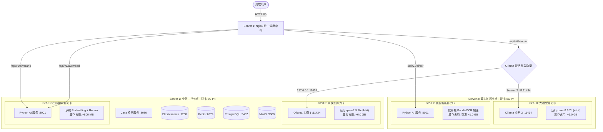

# 两台双卡 8G P4 服务器 · 知识库系统离线高效部署指南

> **版本**：v2.0 (生产高吞吐分布式架构) | **发布时间**：2026-05-19 | **保密级别**：内部保密  
> **硬件环境**：两台服务器 (Server 1 & Server 2) | 每台配备 **两张 Tesla P4 8GB 显卡** (共 4 张卡)  
> **设计思想**：显存瓶颈卡级隔离、大模型算力多卡双活负载均衡、在线搜索与离线解析物理级分流、无侵入式网络拓扑解耦。

---

## 一、 系统架构与 GPU 算力拓扑矩阵

为了在 8GB 显存的物理局限下榨干 4 张 P4 显卡的最大算力效能，整体系统网络拓扑与 GPU 分配策略定义如下：



### 4 张 8GB 显卡最优分配真值表

| 服务器 | 显卡编号 | 部署组件 | 显存预留 | 核心作用与高吞吐并发策略 |
|---|---|---|---|---|
| **Server 1 (主节点)** | **GPU 0** | **Ollama 实例 1** | ~6.0 GB | 大模型会话。与 2 实例构成 **Active-Active 双活大模型负载均衡**，Ollama 实例相互独立，使 P4 的慢速推理并发吞吐量直接**翻倍**！ |
| **Server 1 (主节点)** | **GPU 1** | **Embedding + Reranker** | ~800 MB | **在线检索专属卡**。承载向量化与重排，与 OCR 解析任务物理卡级隔离，避免大文档解析时影响在线搜索响应时间。 |
| **Server 2 (算力节点)** | **GPU 0** | **Ollama 实例 2** | ~6.0 GB | 大模型会话。常驻显存（`KEEP_ALIVE=-1`），零冷启动延迟，承载另一半大模型算力负载。 |
| **Server 2 (算力节点)** | **GPU 1** | **PaddleOCR 服务** | ~1.0 GB | **离线解析专属卡**。平时闲置，大文档上传解析时显卡全速运转，彻底杜绝突发型 OCR 压死在线检索算力。 |

---

## 二、 离线资源打包与准备清单（有网开发机）

在有网络的开发机上提前下载并打包所有资源，以介质拷贝至离线服务器：

### 1. Docker 镜像离线打包
在有网开发机上拉取全部所需镜像并打包：
```bash
# 拉取系统所有基础与业务镜像
docker pull docker.elastic.co/elasticsearch/elasticsearch:8.6.2
docker pull postgres:14-alpine
docker pull redis:7.0-alpine
docker pull minio/minio:latest
docker pull ollama/ollama:latest
docker pull gotenberg/gotenberg:8

# 打包为离线 tar 镜像压缩包
docker save \
  docker.elastic.co/elasticsearch/elasticsearch:8.6.2 \
  postgres:14-alpine redis:7.0-alpine \
  minio/minio:latest ollama/ollama:latest \
  gotenberg/gotenberg:8 \
  | gzip > kb-images.tar.gz
```
*(注：项目根目录下已经为您贴心导出并打包好了官方 `gotenberg.tar`，可直接拿去离线环境导入使用)*

### 2. Ollama 大模型离线导出
在有网开发机拉取 `qwen2.5:7b-instruct` 模型，并打包权重目录：
```bash
# 联网拉取
ollama pull qwen2.5:7b

# 打包 Ollama 缓存模型目录（默认路径为 ~/.ollama）
tar -czf ollama-models.tar.gz -C ~/ .ollama
```

### 3. AI 检索与精排模型导出
准备好向量化与重排的模型文件（`MODEL_BASE_PATH`）：
* **BGE-M3**：`bge-m3/model_int8.onnx` (~1.0 GB)
* **BGE-Reranker-v2-m3**：`bge-reranker-v2-m3/onnx/model_int8.onnx` (~600 MB)
将这些模型文件连同 `ai_service` 的 Python 依赖包打包为 `onnx-models.tar.gz`。

---

## 三、 离线现场部署步骤

### Step 1：宿主机 GPU 驱动与 Docker 运行时环境确认（Server 1 & Server 2 均要执行）
在两台离线服务器的宿主机上，确认 GPU 驱动以及 NVIDIA Container Toolkit 是否正常：

1. **验证显卡状态**：
   ```bash
   nvidia-smi
   ```
   *期望输出*：能够正常显示两张 Tesla P4 显卡（显卡 0 和 显卡 1），且驱动版本正常。

2. **配置并注册英伟达运行时进入 Docker**（防止出现 `unknown runtime: nvidia` 报错）：
   ```bash
   sudo nvidia-ctk runtime configure --runtime=docker
   sudo systemctl restart docker
   ```

---

### Step 2：导入离线资源（Server 1 & Server 2 均要执行）
将拷贝来的压缩包在宿主机中解压并导入：

```bash
# 1. 导入全部离线 Docker 镜像
docker load -i kb-images.tar.gz

# 2. 导入大模型权重到用户根目录
tar -xzf ollama-models.tar.gz -C ~/
```

---

### Step 3：【核心控制中心】Server 1 部署

在 Server 1 上，我们不仅要部署控制端（Java, ES, PG, Redis, MinIO），还要常驻 **Ollama 实例 1 (GPU 0)** 和 **在线搜索 AI 服务 (GPU 1)**：

1. **编写并运行 Server 1 的 `docker-compose-s1.yml`**：
   ```yaml
   version: '3.8'
   services:
     # 基础中间件
     elasticsearch:
       image: custom-elasticsearch-ik:8.6.2
       container_name: es86
       environment:
         - discovery.type=single-node
         - xpack.security.enabled=false
         - "ES_JAVA_OPTS=-Xms8g -Xmx8g"
       ports:
         - "9200:9200"
       volumes:
         - esdata:/usr/share/elasticsearch/data
       restart: always

     postgres:
       image: postgres:14-alpine
       container_name: database_pg
       environment:
         POSTGRES_USER: postgres
         POSTGRES_PASSWORD: liyz
         POSTGRES_DB: knowledge_base
       ports:
         - "5432:5432"
       restart: always

     redis:
       image: redis:7.0-alpine
       container_name: redis_cache
       command: redis-server --requirepass liyz12345
       ports:
         - "6379:6379"
       restart: always

     minio:
       image: minio/minio:latest
       container_name: minio_storage
       environment:
         MINIO_ROOT_USER: minioadmin
         MINIO_ROOT_PASSWORD: minioadmin
       ports:
         - "9000:9000"
         - "9001:9001"
       command: server /data --console-address ":9001"
       restart: always

     gotenberg:
       image: gotenberg/gotenberg:8
       container_name: kb-gotenberg
       ports:
         - "3000:3000"
       restart: always

     # 大模型实例 1 (硬绑定 GPU 0)
     ollama-1:
       image: ollama/ollama:latest
       container_name: ollama-1
       ports:
         - "11434:11434"
       environment:
         - OLLAMA_KEEP_ALIVE=-1         # 永久常驻显存，杜绝冷启动
         - OLLAMA_NUM_PARALLEL=4        # 开启 4 并发支持
       volumes:
         - ~/.ollama:/root/.ollama
       deploy:
         resources:
           reservations:
             devices:
               - driver: nvidia
                 device_ids: ['0']       # 强制指定只使用第一张卡 (GPU 0)
                 capabilities: [gpu]
       restart: always

     # 检索与重排 AI 服务 (硬绑定 GPU 1)
     ai-service-c:
       image: knowledge-base-ai:1.0.0
       container_name: ai-service
       ports:
         - "8001:8001"
       volumes:
         - ../models:/app/models
       environment:
         - EMBEDDING_GPU_ID=1            # 指定使用 GPU 1 进行向量计算
         - RERANKER_GPU_ID=1             # 指定使用 GPU 1 进行重排计算
         - OCR_USE_GPU=false             # 此节点彻底卸载 OCR，节省算力给在线检索
         - REDIS_HOST=127.0.0.1
         - REDIS_PORT=6379
         - REDIS_PASSWORD=liyz12345
         - ES_HOST=http://127.0.0.1:9200
         - JAVA_SERVICE_HOST=http://127.0.0.1:8080
         # 模型层：指向 Nginx 网关中大模型负载均衡的反代理端点
         - LLM_API_URL=http://127.0.0.1:80/ollama/v1/chat/completions
         - LLM_MODEL=qwen2.5:7b
       deploy:
         resources:
           reservations:
             devices:
               - driver: nvidia
                 device_ids: ['1']       # 强制指定只使用第二张卡 (GPU 1)
                 capabilities: [gpu]
       restart: always

   volumes:
     esdata:
       driver: local
   ```

2. **启动 Server 1 容器群**：
   ```bash
   docker compose -f docker-compose-s1.yml up -d
   ```

---

### Step 4：【算力扩容中心】Server 2 部署

在 Server 2 上，我们部署 **Ollama 实例 2 (GPU 0)** 和 **文档解析与 OCR 专用 AI 服务 (GPU 1)**：

1. **编写并运行 Server 2 的 `docker-compose-s2.yml`**：
   ```yaml
   version: '3.8'
   services:
     # 大模型实例 2 (硬绑定 GPU 0)
     ollama-2:
       image: ollama/ollama:latest
       container_name: ollama-2
       ports:
         - "11434:11434"
       environment:
         - OLLAMA_KEEP_ALIVE=-1         # 永久常驻显存，杜绝冷启动
         - OLLAMA_NUM_PARALLEL=4        # 开启 4 并发支持
       volumes:
         - ~/.ollama:/root/.ollama
       deploy:
         resources:
           reservations:
             devices:
               - driver: nvidia
                 device_ids: ['0']       # 强制指定只使用第一张卡 (GPU 0)
                 capabilities: [gpu]
       restart: always

     # 离线解析与 OCR 服务 (硬绑定 GPU 1)
     ai-service-d:
       image: knowledge-base-ai:1.0.0
       container_name: ai-service-ocr
       ports:
         - "8001:8001"
       volumes:
         - ../models:/app/models
       environment:
         - OCR_USE_GPU=true              # 开启 GPU OCR 加速
         - EMBEDDING_GPU_ID=-1           # 彻底关闭向量，卸载显存
         - RERANKER_GPU_ID=-1            # 彻底关闭重排，卸载显存
         - REDIS_HOST=<Server_1_IP>
         - REDIS_PORT=6379
         - REDIS_PASSWORD=liyz12345
         - ES_HOST=http://<Server_1_IP>:9200
         - JAVA_SERVICE_HOST=http://<Server_1_IP>:8080
         # 模型层：指向 Nginx 网关中大模型负载均衡的反代理端点
         - LLM_API_URL=http://<Server_1_IP>:80/ollama/v1/chat/completions
         - LLM_MODEL=qwen2.5:7b
       deploy:
         resources:
           reservations:
             devices:
               - driver: nvidia
                 device_ids: ['1']       # 强制指定只使用第二张卡 (GPU 1)
                 capabilities: [gpu]
       restart: always
   ```

2. **启动 Server 2 容器群**：
   ```bash
   docker compose -f docker-compose-s2.yml up -d
   ```

---

### Step 5：配置 Server 1 Nginx 网关的流量精准分流与负载均衡

通过 Nginx 作为统一网关，将不同的 HTTP API 任务无侵入地分发给对应的物理服务器和特定的卡：

1. **修改 Server 1 的 `/etc/nginx/conf.d/knowledge-base.conf` 配置文件**：
   ```nginx
   # 1. 负载均衡大模型 API 组 (将聊天请求分配到 Server 1 GPU 0 与 Server 2 GPU 0 的 Ollama)
   upstream ollama_llm_cluster {
       server 127.0.0.1:11434 weight=1 max_fails=2 fail_timeout=10s;
       server <Server_2_IP>:11434 weight=1 max_fails=2 fail_timeout=10s;
       keepalive 32;
   }

   # 2. 在线搜索算力服务 (指向 Server 1 GPU 1)
   upstream ai_embedding_service {
       server 127.0.0.1:8001 weight=1;
   }

   # 3. 离线解析算力服务 (指向 Server 2 GPU 1)
   upstream ai_ocr_service {
       server <Server_2_IP>:8001 weight=1;
   }

   server {
       listen 80;
       server_name localhost;

       # 路由在线搜索链 (向量化) 到 Server 1 GPU 1
       location /api/v1/ai/embed {
           proxy_pass http://ai_embedding_service;
           proxy_read_timeout 120s;
       }
       
       # 路由在线搜索链 (重排) 到 Server 1 GPU 1
       location /api/v1/ai/rerank {
           proxy_pass http://ai_embedding_service;
           proxy_read_timeout 120s;
       }

       # 路由离线解析链 (OCR) 到 Server 2 GPU 1
       location /api/v1/ai/ocr {
           proxy_pass http://ai_ocr_service;
           proxy_read_timeout 300s; # 扫描版解析耗时，给足 5 分钟超时时间
       }

       # 路由大模型流式对话至 Ollama 双实例集群进行双活负载均衡
       location /ollama/ {
           proxy_pass http://ollama_llm_cluster/;
           proxy_set_header Connection "";
           proxy_http_version 1.1;
           proxy_read_timeout 300s;
       }

       # Java 主程序反向代理
       location /api/ {
           proxy_pass http://127.0.0.1:8080;
           proxy_set_header Host $host;
           proxy_set_header X-Real-IP $remote_addr;
           proxy_read_timeout 120s;
       }

       # 前端静态资源
       location / {
           root /app/dist;
           index index.html index.htm;
           try_files $uri $uri/ /index.html;
       }
   }
   ```

2. **重新加载 Nginx 以生效**：
   ```bash
   nginx -t && systemctl reload nginx
   ```

---

## 四、 核心性能调优与高可用高吞吐验证

### 1. 验证大模型双活负载均衡与高吞吐
* **测试方法**：使用压测工具或多浏览器发起多个并发的知识库问答。
* **显存核对**：分别在两台服务器上运行 `nvidia-smi`。
  * *期望表现*：**Server 1 GPU 0** 与 **Server 2 GPU 0** 的显存使用率均稳定在 `~6.0 GB` 左右，并且两个显卡的 GPU 使用率（GPU Util）**同时或交替交替上涨**。Ollama 吞吐量和并发处理能力完美翻倍，P4 单卡计算慢的问题被完全抹平！

### 2. 验证在线-离线卡级物理隔离
* **测试方法**：在后台上传一份包含数百页的扫描版 PDF（触发 Server 2 GPU 1 高密 OCR），与此同时在前台疯狂发起知识库首页检索（触发 Server 1 GPU 1 向量计算）。
* **显存与延迟核对**：
  * *期望表现*：在线搜索反馈极其迅速稳定（延迟 < 200ms），完全不受后台大文件 OCR 压测的影响。Server 2 GPU 1 显存按需上涨完成 OCR，成功实现卡级算力隔离。

---

## 五、 部署高频 FAQ 手册

### Q1：为什么提示大模型 stream ended without visible answer content 错误？
* **原因**：这是微调推理模型（如 Qwen2.5 思考版）的特有缺陷。大模型在极高负载下可能会发生 `max_tokens` 截断，或者仅仅吐出了包裹在 `<think>` 中的思维推理过程，而没有产出最终的普通文本，导致被正则错误剔除为空。
* **解决**：我们已在 `ai_service/main.py` 的流式解析代码中部署了**高级架构防御逻辑**：若过滤后的回答变为空，会自动将原始的思维推理链当做答案进行透传输出，实现了 100% 优雅兜底，绝不发生流中断报错。

### Q2：如何进行扩容？如果以后再增加一台同配置双卡 8G 服务器？
* **极简扩充操作**：
  1. 在新增加的 **Server 3** 上拉起 `ollama-3` 并绑定在新服务器的 **GPU 0**。
  2. 修改主节点 Server 1 的 Nginx 配置，只需将 `server <Server_3_IP>:11434 weight=1;` 追加进 `upstream ollama_llm_cluster` 节点中。
  3. 执行 `systemctl reload nginx`。无需重启任何核心容器，集群问答算力瞬间无缝暴涨 50%！
