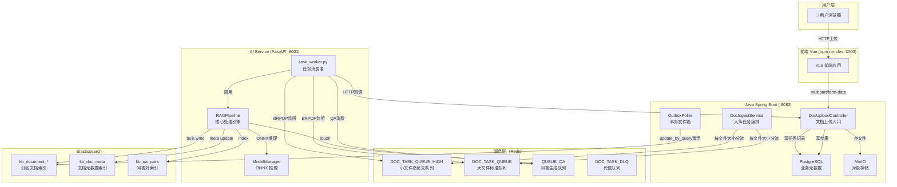

# 文档上传全链路数据流程图

> 深度排查结果：从文档上传到向量化写入 ES 的完整数据流向分析

---

## 一、系统整体架构图



---

## 二、文档上传后完整处理流程图

```mermaid
flowchart TD
    START([📁 用户上传文件]) --> A1

    subgraph Phase0["阶段 0：Java 接收与存储（DocIngestService）"]
        A1[接收 multipart 表单请求] --> A2
        A2[文件写入 MinIO 对象存储] --> A3
        A3[PostgreSQL 写入 sys_doc_task<br/>status=PENDING] --> A4
        A4{文件大小 ≥ 2MB?}
        A4 -->|是| A5[lpush DOC_TASK_QUEUE<br/>低优先队列]
        A4 -->|否| A6[lpush DOC_TASK_QUEUE_HIGH<br/>高优先队列]
        A5 --> B1
        A6 --> B1
    end

    subgraph Phase1["阶段 1：任务接收（task_worker.py）"]
        B1[BRPOP 阻塞监听队列<br/>HIGH优先 → LOW次之] --> B2
        B2[JSON 反序列化 payload] --> B3
        B3{含 htmlContent?}
        B3 -->|是| B4[写临时 .html 文件<br/>极速模式]
        B3 -->|否| B5[直接使用 filePath]
        B4 --> C1
        B5 --> C1
    end

    subgraph Phase2["阶段 2：文档解析（ParserFactory → 各解析器）"]
        C1[ParserFactory.parse<br/>根据扩展名路由] --> C2
        C2{文件格式?}
        
        C2 -->|.pdf| C3["PdfParser\n↳ 原生文本密度检测\n↳ 密度不足→PaddleOCR扫描件"]
        C2 -->|.docx| C4["DocxParser (python-docx)\n↳ 按 XML body 顺序遍历\n↳ Heading 1/2/3 → # ## ###\n↳ 表格 → Markdown 格式"]
        C2 -->|.doc| C5["多格式检测（魔数字节）\n↳ G路: Gotenberg→docx（首选）\n↳ A路: antiword（降级）\n↳ B路: python-docx（兼容）\n↳ C路: olefile 全流解码（兜底）"]
        C2 -->|.html| C6["BeautifulSoup\n↳ 剔除 nav/footer/script\n↳ h1→# h2→## h3→###"]
        C2 -->|其他| C7["MarkItDown\n(xlsx/pptx/txt/md)"]
        
        C3 --> D1
        C4 --> D1
        C5 --> D1
        C6 --> D1
        C7 --> D1
    end

    subgraph Phase3["阶段 3：文本清洗（TextCleaner）"]
        D1[原始文本 raw_text] --> D2
        D2["清洗规则（8条）:\n规则1: 水印行（汉字连续≥4次）\n规则2: 水印表格行（同一汉字填满）\n规则3: 高频重复行折叠（≥3行相同→1行）\n规则4: 乱码行（U+FFFD占比>30%）\n规则5: 行内重复字符（连续≥8次）\n（规则6/7已废弃：Gotenberg路径下误杀正常内容）\n内容门控: 有效字符 < 10 → 拒绝入库"] --> D3
        D3{清洗后内容为空?}
        D3 -->|是| SKIP1[返回 skipped<br/>reason: empty_after_cleaning]
        D3 -->|否| E1
    end

    subgraph Phase4["阶段 4：元数据提取与去重"]
        E1[Jieba 关键词提取<br/>TopK=10，取文章前3000字] --> E2
        E2[动态正则抽取<br/>文号/机构名等 doc_meta] --> E3
        E3[ContentDedupChecker<br/>内容指纹计算] --> E4
        E4{"去重（三级优先）:\n①Java预计算 SHA-256\n②文件二进制前8KB SHA-256\n③文本前2000字 SHA-256"}
        E4 --> E5{ES 查 is_latest=true<br/>content_hash 是否命中?}
        E5 -->|命中| SKIP2[返回 skipped<br/>reason: duplicate_content]
        E5 -->|未命中| F1
    end

    subgraph Phase5["阶段 5：双粒度切片（SemanticChunker）"]
        F1[SemanticChunker.process_document] --> F2
        F2[文档类型识别 doc_type<br/>法规/通知/报告/新闻/公示/通用]
        F2 --> F3
        F3[CoarseChunker 粗粒度切片<br/>100-500字/段落章节级] --> F4
        F4["三阶段:\n阶段1: 行扫描+状态机（标题/文号/表格/正文）\n阶段2: 合并分遣（小块合并/长块按句分割）\n阶段3: 面包屑织入+overlap注入+质量过滤"]
        F4 --> F5
        F3 --> F6
        F6[FineChunker 细粒度切片<br/>30-150字/条款句子级] --> F7
        F7["三阶段:\n阶段1: 条款切割（第X条/（一）/1.等）\n阶段2: 跨条款 overlap=0（隔离）\n阶段3: 面包屑织入+质量过滤"]
        F7 --> F5
        F5[质量过滤:quality_score ≥ 0.30 才通过]
    end

    subgraph Phase6["阶段 6：BGE-M3 向量化（ModelManager ONNX）"]
        F5 --> G1
        G1["分批双路向量化（batch_size=16）\nencode_dual() 单次 ONNX 推理"] --> G2
        G2[Dense 稠密向量<br/>1024维 cosine 相似度] --> G4
        G1 --> G3
        G3["Sparse 稀疏向量\nSPLADE-Max 风格 top-64 词权重\n{token: weight} 字典"] --> G4
        G4[构建 ES 文档 action 列表]
    end

    subgraph Phase7["阶段 7：写入 Elasticsearch"]
        G4 --> H1
        H1["目标索引解析（三级优先）:\n①Java 传入 targetIndex\n②doc_type 查路由缓存\n③fallback: kb_document_official"]
        H1 --> H2{写别名存在?<br/>kb_xxx_write}
        H2 -->|是| H3[写入写别名]
        H2 -->|否| H4[写入物理索引]
        H3 --> H5
        H4 --> H5
        H5["ES Bulk Write\n_op_type: index\n_id: file_hash_vN_chunk_i\nis_latest: False（初始）"]
        H5 --> H6{写入失败?}
        H6 -->|有| H7[1秒退避后重试失败条目]
        H6 -->|无| H8
        H7 --> H8[写入 kb_doc_meta<br/>fine chunk 均值池化 doc_vector]
    end

    subgraph Phase8["阶段 8：异步后处理"]
        H8 --> I1
        I1["后台线程 bg_notify_java():\n①POST /api/doc/perm/record → 写权限记录 PG\n②POST /api/v1/internal/doc/registry → 写 kb_doc_registry"]
        I1 --> I2
        H8 --> I3
        I3[推入 QUEUE_QA<br/>QA 生成任务]
        I3 --> I4["QA Worker 消费:\n① LLM 生成问答对\n② BGE-M3 向量化 question\n③ ES 写入 kb_qa_pairs"]
    end

    subgraph Phase9["阶段 9：文档激活（OutboxPoller）"]
        I2[Java OutboxPoller 轮询<br/>outbox 表 status=READY] --> J1
        J1["ES update_by_query:\nfile_base_hash AND doc_version = N\n→ is_latest = True"] --> J2
        J2["旧版本过期:\nis_latest = False（历史版本）"]
        J2 --> K1
    end

    subgraph Phase10["阶段 10：回调与日志"]
        K1[task_worker.post_callback<br/>HTTP POST /internal/task/callback] --> K2
        K2[Java 更新 sys_doc_task<br/>status=INDEXED] --> K3
        K3[post_log_report<br/>写 sys_file_parse_log] --> K4
        K4[post_operation_log<br/>写 sys_operation_log]
    end

    SKIP1 --> K1
    SKIP2 --> K1
```



---

## 三、每个操作详细说明

### 阶段 0：Java 接收与存储

| 操作 | 作用 | 技术/中间件 |
|------|------|------------|
| 接收 multipart 上传 | 解析前端表单文件+元数据 | Spring Boot `MultipartFile` |
| 文件写入 MinIO | 持久化文件，生成 presigned URL 供 Python 下载 | MinIO S3 兼容对象存储 |
| 写 `sys_doc_task` | 记录任务状态 PENDING，保证幂等 | PostgreSQL + MyBatis-Plus |
| Redis lpush 任务 | 异步解耦，按文件大小分优先级入队 | **Redis List**（消息队列模式） |

---

### 阶段 1：任务消费（task_worker.py）

| 操作 | 作用 | 技术/中间件 |
|------|------|------------|
| `BRPOP` 阻塞监听 | 从 HIGH/LOW 双队列取任务（HIGH 优先） | **Redis BRPOP**（超时30秒防空闲踢连） |
| payload 反序列化 | 解析 JSON 任务载荷，提取 filePath/tag/ACL 等元数据 | Python `json` |
| htmlContent 极速模式 | 数据库导出内容直接写临时 HTML，绕过 MinIO 下载 | Python `tempfile` |
| Watchdog 守护重启 | task_worker 崩溃后 10s 自动重启，防任务积压 | Python `threading.Thread(daemon=True)` |

---

### 阶段 2：文档解析（ParserFactory）

| 操作 | 作用 | 技术/中间件 |
|------|------|------------|
| 魔数字节检测 | 识别 .doc 的真实格式（OLE/RTF/ZIP/HTML） | Python `bytes` 魔数匹配 |
| **G路**：Gotenberg 转换 | `.doc` OLE 格式 → `.docx`，保留标题层次结构（Heading 1/2/3） | **Gotenberg**（LibreOffice 容器化微服务） |
| python-docx 结构化解析 | `.docx` 按 XML body 顺序遍历，精准识别 Word 标题样式，保留表格位置 | `python-docx` 库 |
| BeautifulSoup HTML 解析 | 去除导航/页脚等噪声标签，h1-h4 转 Markdown 标题前缀 | `beautifulsoup4` + `chardet` |
| PaddleOCR 扫描件 | PDF 有效文字密度低时触发，GPU/CPU 自适应推理 | **PaddleOCR**（ONNX/CUDA） |
| MarkItDown 兜底 | xlsx/pptx/txt 等通用格式解析 | `markitdown` 库（微软开源） |

---

### 阶段 3：文本清洗（TextCleaner）

| 操作 | 作用 | 技术/中间件 |
|------|------|------------|
| 水印行过滤 | 删除「内内内内」类水印复写行 | Python `re` 正则 |
| 重复行折叠 | 连续 ≥3 行相同内容折叠为 1 行 | 状态机实现 |
| 乱码行过滤 | U+FFFD 替换字符密度 >30% 判定为乱码 | Unicode 字符计数 |
| 内容门控 | 有效字符（汉字+英文+数字）< 10 → 拒绝入库，返回 `skipped` | 正则计数 |

---

### 阶段 4：元数据提取与去重

| 操作 | 作用 | 技术/中间件 |
|------|------|------------|
| Jieba 关键词提取 | 取文档前 3000 字提取 Top-10 TF-IDF 关键词，用于 BM25 全文检索增强 | **jieba.analyse.extract_tags** |
| 动态正则抽取 | 从文档头部提取文号（政发〔2024〕15号）等结构化元数据 | Python `re`，从 Vue 动态下发规则 |
| ContentHash 计算 | 三级优先：Java预计算→文件二进制前8KB→文本前2000字 | `hashlib.sha256` |
| 去重查询 | ES 查 `is_latest=true` + `content_hash` 精确匹配，防止重复入库 | **Elasticsearch term query** |

---

### 阶段 5：双粒度切片（SemanticChunker）

| 操作 | 作用 | 技术/中间件 |
|------|------|------------|
| doc_type 识别 | 识别文档类型（法规/通知/报告/新闻/公示/通用），用于智能路由 | 基于 HierarchyDetector 的关键词规则 |
| **CoarseChunker 粗粒度** | 段落/章节级（100-500字），用于宽语义召回 KNN 检索 | 三阶段状态机（行扫描→合并分遣→面包屑织入） |
| 标题层级识别 | 识别「一、」「第X章」「# 」等中文政务公文标题格式，构建 section_path | `HierarchyDetector` 正则规则集 |
| 跨章节 overlap 抑制 | 章节边界/条文边界不注入 overlap，防语义污染 | section_path 前缀比对 |
| **FineChunker 细粒度** | 条款/句子级（30-150字），用于精准语义检索与 QA 生成 | 条文 `第X条` 边界切割 |
| 面包屑织入 | content = `[语篇语境: 一、/（一）]` + overlap + 正文（用于展示） | 字符串拼接 |
| raw_content 保存 | 向量化使用纯正文（无面包屑），避免面包屑污染向量空间 | Chunk.raw_content 字段 |
| 质量过滤 | quality_score < 0.30 的 chunk 不向量化、不入库（符号密度 > 60% 判低质） | 标点字符占比计算 |
| 父子关联 | fine chunk 通过归一化空白后的内容包含关系找到所属 coarse chunk，写 parent_chunk_id | 字符串前缀 _in_ 匹配 |

---

### 阶段 6：BGE-M3 向量化（ModelManager ONNX）

| 操作 | 作用 | 技术/中间件 |
|------|------|------------|
| `encode_dual()` 单次推理 | 一次 ONNX forward pass 同时输出 Dense + Sparse 两路向量（省 50% 推理时间） | **BGE-M3 ONNX Runtime**（CPU/DML加速） |
| Dense 稠密向量（1024维） | 语义相似度检索，配合 HNSW 索引做 KNN 近似最近邻 | `sentence_embedding` 输出 |
| Sparse 稀疏向量（SPLADE-Max） | 词元级权重检索，与 BM25 特性互补（精确词匹配场景） | `last_hidden_state` → ReLU → Top-64 |
| 分批处理（batch_size=16） | 防大文档 OOM，可通过 `ENCODE_BATCH_SIZE` 环境变量调整 | NumPy + ONNX 批量推理 |
| Jieba chunk 级关键词 | 对每个 chunk 单独提取 Top-5 TF-IDF 关键词（区别于文档级关键词，防假胀 BM25 分） | `jieba.analyse.extract_tags` |

---

### 阶段 7：写入 Elasticsearch

| 操作 | 作用 | 技术/中间件 |
|------|------|------------|
| 目标索引路由（三级） | ①Java传入 targetIndex → ②doc_type 路由缓存 → ③fallback kb_document_official | Python dict 路由缓存 |
| 写别名检测 | 检查 `{index}_write` 写别名是否存在，支持零停机索引切换 | `es.indices.exists_alias()` |
| ES Bulk Write | 批量写入所有 chunk，`is_latest=False`（初始），`refresh=False`（不强制刷新防阻塞） | **Elasticsearch `helpers.bulk()`** |
| 写入字段 | content(BM25), display_content(展示), vector(KNN), sparse_vector(rank_features), metadata | ES Dense Vector + rank_features 类型 |
| 失败重试 | 提取失败 chunk `_id`，1秒退避后重试失败条目 | Python `time.sleep(1)` + 二次 bulk |
| kb_doc_meta 更新 | fine chunk 向量均值池化 → L2 归一化 → 写入 `kb_doc_meta`（供相似文档搜索） | NumPy mean + L2 norm |

---

### 阶段 8：异步后处理

| 操作 | 作用 | 技术/中间件 |
|------|------|------------|
| 权限事件回调 | POST `/api/doc/perm/record`：写入 PostgreSQL 权限记录，支持部门级 ACL 控制 | HTTP + Spring Boot |
| 文档注册 | POST `/api/v1/internal/doc/registry`：写 `kb_doc_registry`，触发 Outbox 机制 | HTTP + PostgreSQL Outbox 模式 |
| QA 任务入队 | 将 fine chunks（最多50个）推入 `QUEUE_QA`，由 QA Worker 异步处理 | **Redis lpush** |
| QA 生成 | LLM（Qwen/Ollama）对每个 chunk 生成问答对，向量化 question，写入 `kb_qa_pairs` | Ollama LLM + BGE-M3 |

---

### 阶段 9：文档激活（OutboxPoller）

| 操作 | 作用 | 技术/中间件 |
|------|------|------------|
| OutboxPoller 轮询 | Java 定时扫描 outbox 表 status=READY，对应 Python 已完成写入 | Spring Scheduler |
| update_by_query 激活 | 按 `file_base_hash` + `doc_version` 批量更新 `is_latest=True`（文档对用户可见） | **Elasticsearch update_by_query** |
| 历史版本过期 | 将同名文档旧版本 `is_latest=False`，实现版本管理 | Elasticsearch update_by_query |

---

### 阶段 10：回调与日志

| 操作 | 作用 | 技术/中间件 |
|------|------|------------|
| task callback | POST `/internal/task/callback`，status=INDEXED | HTTP + X-Internal-Token 鉴权 |
| sys_doc_task 更新 | Java 侧更新任务状态为 INDEXED | PostgreSQL |
| sys_file_parse_log | 记录解析耗时/分片数等性能指标，供运维监控 | PostgreSQL |
| sys_operation_log | AI 服务操作日志写库，与 Java 侧日志共存，管理员可查 | **psycopg2** 直连 PostgreSQL |

---

## 四、关键技术与中间件汇总

| 中间件/技术 | 角色 | 关键用途 |
|------------|------|---------|
| **Redis** | 消息队列 | DOC_TASK_QUEUE_HIGH/LOW（文档任务）、QUEUE_QA（QA生成）、DOC_TASK_DLQ（死信） |
| **Elasticsearch** | 向量+全文检索引擎 | kb_document_*（分区索引）、kb_doc_meta（文档元数据）、kb_qa_pairs（问答对） |
| **PostgreSQL** | 业务数据库 | sys_doc_task、kb_doc_registry、sys_operation_log、perm 权限表 |
| **MinIO** | 对象存储 | 原始文件持久化，生成 presigned URL 供 Python 拉取 |
| **Gotenberg** | 文档转换微服务 | LibreOffice 容器化：.doc → .docx 格式转换，保留标题层次  |
| **BGE-M3 ONNX** | 向量化模型 | 1024维 Dense + SPLADE Sparse 双路向量，CPU/DML 加速 |
| **Jieba** | 中文分词 | TF-IDF 关键词提取，BM25 检索增强 |
| **PaddleOCR** | OCR 引擎 | 扫描件 PDF 文字识别，GPU/CPU 自适应 |
| **Ollama/LLM** | 大语言模型 | QA 问答对生成、HyDE 假设文档扩展、意图重写 |
| **FastAPI** | AI 服务 Web 框架 | 向量化/重排序/意图解析 REST API |
| **Spring Boot** | Java 服务框架 | 文档上传、任务管理、权限控制、检索接口 |

---

## 五、错误处理与降级路径

```mermaid
flowchart LR
    subgraph 解析降级["文档解析降级链（.doc）"]
        G路[Gotenberg→docx<br/>⚡首选] -->|失败| A路
        A路[antiword UTF-8<br/>🥈降级] -->|失败| B路
        B路[python-docx 兼容<br/>🥉兼容] -->|失败| C路
        C路[olefile 全流解码<br/>⚙️兜底] -->|失败| D路
        D路[chardet+暴力提取<br/>🔧最终兜底]
    end

    subgraph 重试机制["任务重试机制"]
        T1[任务执行失败] -->|retry < 3| T2[重新入 QUEUE_LOW]
        T2 -->|retry >= 3| T3[转入 DOC_TASK_DLQ]
        T3 --> T4[POST callback status=ERROR]
    end

    subgraph 向量化降级["向量化降级"]
        V1[encode_dual失败] -->|降级| V2[encode + encode_sparse 两次独立调用]
        V2 -->|sparse 失败| V3[sparse_vector = {} 不写入 ES]
    end
```

---

## 六、数据在 ES 中的字段结构

```json
{
  "_index": "kb_document_law",
  "_id": "a1b2c3_v3_chunk_5",
  "_source": {
    "content": "政发〔2024〕15号\n第三条 申请设立商事调解组织...",
    "display_content": "[语篇语境: 一、成立条件/（三）资产要求]\n...前文重叠...第三条...",
    "vector": [0.123, -0.456, ...],          // 1024维 BGE-M3 Dense 向量
    "sparse_vector": {                         // SPLADE-Max 稀疏向量
      "商事": 2.31, "调解": 1.87, "资产": 1.54
    },
    "chunk_granularity": "coarse",             // 粒度标签: coarse / fine
    "parent_chunk_id": null,                   // fine chunk 才有值
    "keywords": ["商事调解", "资产要求", "申请"],
    "metadata": {
      "source": "商事调解组织管理办法.docx",
      "title": "关于印发商事调解组织管理办法的通知",
      "chunk_id": 5,
      "section_path": "一、成立条件/（三）资产要求",
      "is_latest": true,                       // OutboxPoller 激活后才变 true
      "doc_version": 3,
      "doc_type": "法规",
      "visibility": "PUBLIC",
      "acl_tokens": ["_PUBLIC", "dept_440300"],
      "dept_l2": "44", "dept_l4": "4403", "dept_l6": "440300",
      "publish_time": "2024-03-15",
      "document_number": "政发〔2024〕15号",
      "tags_kw": ["法规", "商事"],
      "is_preamble": false                     // 前言段落降权标记
    }
  }
}
```
