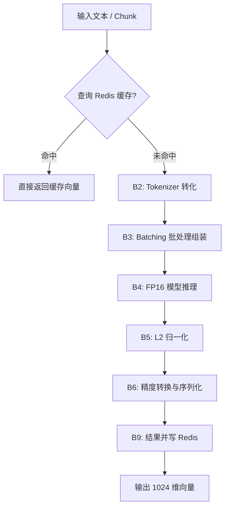

# BGE-m3 模型向量化（FP16）原子功能拆解

## 一、原子功能清单

| #       | 原子功能                   | 说明                                                                      | 输入 → 输出                       |
| ------- | ---------------------- | ----------------------------------------------------------------------- | ----------------------------- |
| **B1**  | 模型离线加载 (FP16)          | 在 Python (FastAPI) 服务启动时，以半精度 (FP16) 模式将 BGE-m3 模型及其权重加载到 GPU 显存。       | 模型路径 → Model 对象               |
| **B2**  | 文本 Token 化 (Tokenizer) | 将原始文本分片 (Chunk) 转换为模型可处理的 Token ID 序列，自动截断超长文本 (最大 512/8k) 或补充 Padding。 | 纯文本 → Tensor (Token IDs)      |
| **B3**  | 推理任务调度 (Batching)      | 根据配置的 Batch Size (如 16 或 32)，将多个并发请求的 Chunk 组装成小批次，利用 GPU 并行能力。         | 多个 Token ID 序列 → Batch Tensor |
| **B4**  | FP16 半精度推理执行           | 调用 PyTorch 推理引擎，在 FP16 模式下执行模型前向传播，计算 Dense Embedding (稠密向量)。           | Batch Tensor → 原始特征向量         |
| **B5**  | 特征归一化 (Normalization)  | 对模型输出的原始向量进行 L2 归一化处理，以便直接使用余弦相似度进行检索。                                  | 原始特征向量 → 1024 维归一化向量          |
| **B6**  | 精度转换与序列化               | 保证向量输出为 Float32 列表，以便通过 REST API 返回及存入 ES。                              | FP16 Tensor → Float 列表        |
| **B7**  | 查询语义编码 (Query Encoder) | 专门处理检索词 (Query)，确保检索词经过与正文相同的预处理逻辑。                                     | 用户查询词 → 1024 维 Query 向量       |
| **B8**  | 显存/超时异常处理              | 监控模型推理状态，遇 CUDA OOM (显存溢出) 或推理超时自动重试。                                   | 错误状态 → 重试指令/告警                |
| **B9**  | 向量结果缓存 (Redis)         | 对于相同的文本内容（MD5），将向量结果缓存到 Redis，避免重复计算。                                   | 文本哈希 → 向量缓存                   |
| **B10** | 模型热加载/健康探活             | 导出 `/health` 接口，汇报模型加载状态、显存占用情况及推理服务是否就绪。   | GET 请求 → 健康状态 JSON            |

## 二、处理流程

## 三、涉及的技术与工具

| 原子功能      | 技术/库                              | 关键要点                                |
| --------- | --------------------------------- | ----------------------------------- |
| **模型框架**  | `FlagEmbedding` / `PyTorch`       | 官方底层库，支持 BGE-m3 完整特性。               |
| **精度优化**  | `torch.float16` (Mixed Precision) | 相比 FP32，显存占用降低 50%，速度提升 2~3 倍。      |
| **模型加载**  | `Sentence-Transformers`           | 封装良好的 Embedding 加载库，易于与 FastAPI 集成。 |
| **性能加速**  | `NVIDIA CUDA` + `cuDNN`           | 核心计算驱动。                             |
| **微服务框架** | `FastAPI`                         | 支持异步 IO，适合处理耗时的推理请求。                |
| **分布式调度** | `Kafka` (异步入库场景)                  | 接收批量文档向量化任务，解耦计算与存储。                |

## 四、关键配置参数

| 参数                   | 默认值           | 说明                          |
| -------------------- | ------------- | --------------------------- |
| `model_name_or_path` | `BGE-m3` 内网路径 | 模型本地权重目录                    |
| `batch_size`         | 32            | GPU 并行推理大小，视显存大小调整          |
| `max_length`         | 8192          | BGE-m3 最大支持长度，默认为 512 以均衡速度 |
| `use_fp16`           | True          | 是否开启半精度推理                   |
| `device`             | `cuda`        | 运行设备，内网强制使用 GPU             |
| `cache_ttl`          | 3600 (秒)      | Redis 缓存过期时间                |

---
