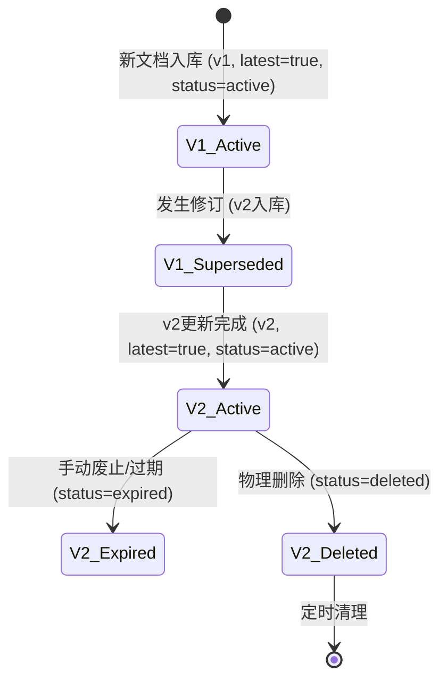

# 数据一致性与版本管理模块原子功能拆解

## 一、原子功能清单

| #      | 原子功能               | 说明                                                                                           | 核心技术                          |
| ------ | ------------------ | -------------------------------------------------------------------------------------------- | ----------------------------- |
| **H1** | 版本号递增引擎            | 修订文档时, 根据 `doc_id` 从 MySQL 获取当前最大版本并 +1 生成新版本号。                                              | MySQL `LOCK IN SHARE MODE`    |
| **H2** | 原子化 LATEST 切换      | 更新 ES 时, 执行 `update_by_query` 将旧版本的 `is_latest` 设置为 false，同时将新分片写入并设为 true。                  | ES `update_by_query` + Script |
| **H3** | 消息幂等性检查            | 消费 Kafka 时, 校验消息中携带的 `timestamp`，拒绝处理早于 ES 中已有记录的更新消息。                                       | 乐观锁 / 时间戳比较                   |
| **H4** | 延迟逻辑删除             | 处理业务系统的删除指令，先在 ES 中标记 `doc_status = deleted`（软删除），并在 7 天后执行物理删除。 | TTL 索引 / 定时清理任务               |
| **H5** | 数据对账扫描器            | 每日凌晨对比 MySQL `documents` 表与 ES 索引中的文档总数及最新版本号，记录差异。                                          | 定时任务 + 聚合查询                   |
| **H6** | 自动补偿机制 (Reprocess) | 针对对账发现的差异文档，自动发送修复任务到 Kafka `doc_vector_task` 重新处理。                                          | 补偿调度逻辑                        |
| **H7** | 缓存强一致清退            | 处理版本更新后，立即根据缓存 key 规则失效该文档的 Query 向量缓存及搜索结果缓存。                                               | Redis `DEL`                   |

## 二、版本状态流转图



## 三、关键策略

### 1. 最终一致性保障

由于向量化推理耗时较长（秒级），无法在 Web 请求中做同步强一致。采用 **Kafka 顺序消费 + 版本盖戳** 的方式，保证即使用户连续提交多次修改，最终留在 ES 里的也是最后一次修改的版本。

### 2. 修订时的原子切换

```javascript
// ES Script 处理逻辑
ctx._source.is_latest = false;
ctx._source.doc_status = "superseded";
```

## 四、关键配置参数

| 参数                       | 默认值           | 说明                     |
| ------------------------ | ------------- | ---------------------- |
| `sync.audit_cron`        | `0 0 2 * * ?` | 全量对账任务执行时间（默认每日凌晨 2 点） |
| `sync.delete_delay_days` | 7             | 逻辑删除到物理删除的缓冲天数         |
| `sync.idempotent_window` | 3600          | 幂等性校验的时间窗口（秒）          |

---
