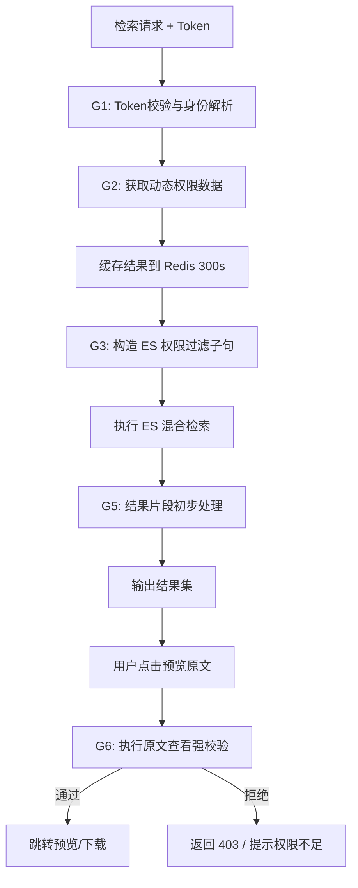

# 权限控制模块原子功能拆解

## 一、原子功能清单

| #      | 原子功能       | 说明                                                      | 核心技术                       | 备注 |
| ------ | ---------- | ------------------------------------------------------- | -------------------------- | ------------------------------ |
| **G1** | Token 身份预检 | 解析现有系统的自研 Token，提取 `user_id` 和基本部门信息。                   | JWT / 自研接口校验               |                                |
| **G2** | 动态权限列表拉取   | 实时从现有系统获取：用户所在部门、其作为参与者的 doc_id 列表、下级部门列表。              | REST API 缓存化调用             |                                |
| **G3** | 检索过滤表达式注入  | 将[创建人ID]、[参与者列表]、[部门可见性]、[公开状态]封装为 ES `bool` filter 条件。 | Java 侧 DSL 拼接              |                                |
| **G4** | 部门层级透视过滤   | 根据下级部门公开规则，自动包含所有属于该用户具有权限的下级部门文档。                      | 树形结构范围匹配                   |                                |
| **G5** | 内容脱敏展示     | 针对未获得原文件查看权限但能搜到摘要的情况，对摘要中的敏感词进行遮蔽（脱敏）。                 | 正则 / 敏感词库                  | **后期扩展**                       |
| **G6** | 原文查看二次强校验  | 在点击"查看原文"或下载时，再次发起高等级权限鉴权，防止通过直接 URL 越权。                | AOP 权限拦截器                  |                                |
| **G7** | 权限变更实时更新   | 当用户调岗或文档权限修改时，同步更新 ES 中的对应记录（或失效用户检索缓存）。                | Kafka 权限变更事件               |                                |
| **G8** | 审计与违规尝试监控  | 记录所有越权访问尝试，并根据频率触发安全警告。                                 | MySQL `security_audit_log` |                                |

## 二、处理流程



## 三、权限映射规则（MVP 逻辑）

- **作者权**：`creator_id == CURRENT_USER`
- **参与权**：`participant_ids contains CURRENT_USER`
- **部门公开**：`visibility_scope == "DEPT" AND dept_id == USER_DEPT`
- **下级公开**：`visibility_scope == "SUB_DEPT" AND dept_id IN USER_SUB_DEPTS`
- **全公开**：`visibility_scope == "PUBLIC"`

**ES 检索过滤伪代码**：

```json
"filter": [
  {
    "bool": {
      "should": [
        { "term": { "creator_id": "user_123" } },
        { "term": { "participant_ids": "user_123" } },
        { "bool": {
           "must": [
             { "term": { "visibility_scope": "DEPT" } },
             { "term": { "dept_id": "dept_456" } }
           ]
        }},
        { "term": { "visibility_scope": "PUBLIC" } }
      ]
    }
  }
]
```

## 四、关键配置参数

| 参数                 | 默认值     | 说明                |
| ------------------ | ------- | ----------------- |
| `auth.cache_ttl`   | 300 (秒) | 权限结果在 Redis 的缓存时间 |
| `auth.strict_mode` | True    | 权限接口挂掉时是否拒绝所有搜索请求 |
| `preview.recheck`  | True    | 预览文档时是否重新执行权限校验   |

---
