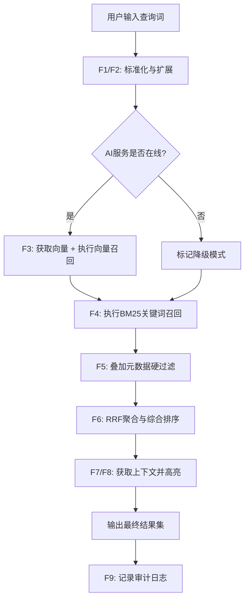

# 混合检索引擎模块原子功能拆解

## 一、原子功能清单

| #       | 原子功能                | 说明                                                                           | 核心技术                     |
| ------- | ------------------- | ---------------------------------------------------------------------------- | ------------------------ |
| **F1**  | 查询词标准化 (Query Norm) | 对用户搜索词进行繁简转换、全半角转换、拼音纠错。                                                     | `HanLP` / `pypinyin`     |
| **F2**  | 关键术语映射 (Synonyms)   | 匹配内网同义词表（如"发改委"-> "发展和改革委员会"），进行查询扩展。                                        | ES `synonym` filter      |
| **F3**  | 向量语义召回 (kNN)        | 调用 AI 服务获取 Query 向量，在 ES 中执行 HNSW 向量搜索，返回候选集。                                | ES `knn` query           |
| **F4**  | 文本关键词召回 (BM25)      | 在文档标题、正文、文号字段执行全文检索，利用 ES 默认的 BM25 算法评估得分。                                   | ES `multi_match`         |
| **F5**  | 元数据前置过滤             | 在 ES 召回前，强制注入结构化筛选条件（发文日期区间、所属部门、密级）。                                        | ES `filter`              |
| **F6**  | RRF 混合重排 (Rerank)   | 使用 Reciprocal Rank Fusion 算法整合向量分与关键词分，计算最终综合排名。 | ES `rank: {rrf: {}}`     |
| **F7**  | 上下文窗口获取             | 为命中的 Chunk 获取其在原文中的相邻 Chunk，提供 1~2 段的背景信息。                                   | ES `terms` 关联查询          |
| **F8**  | 动态高亮展示              | 识别命中片段中的关键词，并生成 HTML 高亮标签（含语义匹配的部分标注）。                                       | ES `highlight`           |
| **F9**  | 搜索轨迹记录              | 记录 Query、召回结果列表、最终点击位次。                                                      | MySQL `search_audit_log` |
| **F10** | 响应结果降级              | 遇向量搜索异常（AI 服务挂掉）时，自动回退到纯 BM25 搜索。                                            | Java 异常捕获策略              |

## 二、处理流程

## 三、涉及的技术与工具

- **核心算法**：RRF (Reciprocal Rank Fusion)，权重公式 `score = sum(1 / (k + rank_i))`，默认 `k=60`。
- **检索逻辑**：Java 侧组装 ES DSL 语句，ES 8.6 服务端并行执行。
- **降级机制**：Java 侧使用 `CircuitBreaker` (如 Resilience4j) 监控 Python 接口，失败则自动切换检索策略。

## 四、关键配置参数

| 参数                        | 默认值 | 说明              |
| ------------------------- | --- | --------------- |
| `search.top_k`            | 50  | 每路召回的原始文档数      |
| `search.max_result`       | 20  | 最终展示给用户的数量      |
| `rrf.window_size`         | 60  | RRF 算法的平滑常数     |
| `highlight.fragment_size` | 150 | 高亮片段显示的长度       |
| `degrade.threshold`       | 3   | 连续失败 N 次后进入降级状态 |

---
