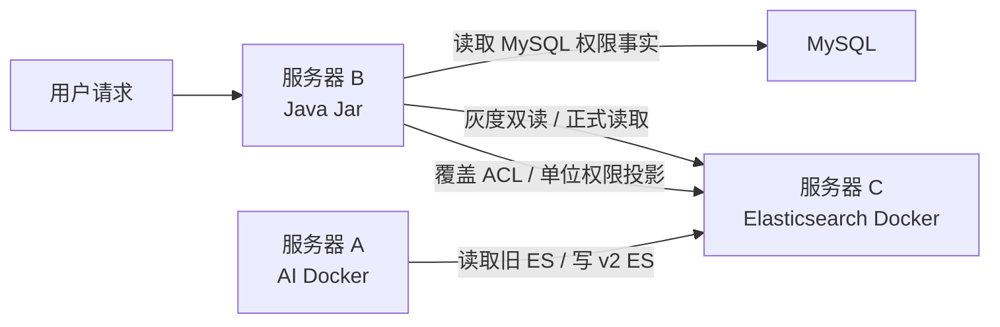

# 历史数据迁移方案 v1.1

## 1. 背景与目标

当前在线环境历史文档数据已经迁移到 v2 索引，离线环境仍存在历史 ES 数据需要补全和迁移。

离线环境部署情况：

- 服务器 A：AI 服务，Docker 部署。
- 服务器 B：Java 服务，Jar 部署。
- 服务器 C：Elasticsearch，Docker 部署，需要账号密码。
- 历史索引与新版索引结构不同，且历史权限字段存在缺失。

已确认历史索引：

- `kb_document_v1`
- `kb_document_law`
- `kb_qa_pairs`
- `kb_doc_meta`
- `kb_doc_search_v1`

目标：

- 将离线 ES 历史数据迁移到当前仓库约定的 v2 索引和别名体系。
- 从 MySQL 补全权限字段，不能信任历史 ES 中缺失或过期的权限字段。
- 支持灰度双写、双读、可回滚切换。
- 保留旧索引，不做原地修改。

## 2. 第一性原理分析与决策判断

### 2.1 数据事实与权限事实必须分离

文档检索系统至少包含两类事实：

- 内容事实：文档正文、chunk、标题、来源、QA、元数据、检索字段。
- 权限事实：谁能看、哪些单位能看、授权版本、可见范围。

历史 ES 只适合作为内容事实来源，因为它已经明确存在权限字段缺失问题。权限字段一旦缺失，如果迁移时默认放行，就会产生越权；如果默认内部可见，也可能扩大可见范围。因此权限事实必须来自 MySQL。

结论：

- 内容从历史 ES 读取。
- 权限从 MySQL 读取。
- 目标 ES 中的权限字段只是 MySQL 权限事实的投影。
- 缺失权限不得默认放行，统一写入 `_NO_ACCESS` 并输出人工补权清单。

### 2.2 Java 服务访问 ES 是合理决策

Java 服务本身掌握业务权限模型和 MySQL 数据访问能力，让 Java 服务负责权限投影更合理。

原因：

- Python/AI 迁移脚本能处理 ES 结构转换，但不应该重新实现业务权限规则。
- 权限规则变化应集中在 Java 服务，避免多套实现产生分歧。
- Java 服务已经具备向 ES 同步 ACL 投影的职责边界。

结论：

- AI 容器负责结构迁移、辅助索引重建、校验报表。
- Java 服务负责从 MySQL 读取权威权限并覆盖 ES 权限投影。

### 2.3 灰度双写/双读合理，但必须有退出条件

双写/双读的价值是降低一次性切换风险，但长期双写会制造新的不一致来源。

合理做法：

- 迁移构建期：旧读不变，新索引后台构建。
- 校验期：双读只做 shadow compare，不影响用户返回。
- 灰度期：按用户、部门或比例切到 v2 读。
- 稳定期：关闭旧写和双读，旧索引只读保留一段时间。

不合理做法：

- 长期同时维护 v1/v2 双写。
- 用别名频繁来回切换模拟灰度。
- 权限未覆盖完成就开放 v2 读。

## 3. 总体架构



职责划分：

- 服务器 A：
  - 执行 ES 索引结构迁移脚本。
  - 重建 `kb_doc_meta`、`kb_doc_search`、`kb_qa_pairs` 等辅助索引。
  - 生成迁移报告和差异清单。
- 服务器 B：
  - 从 MySQL 导出或查询文档权限。
  - 调用权限投影逻辑覆盖目标 ES 索引字段。
  - 执行灰度双读、双写控制。
- 服务器 C：
  - 保留旧索引。
  - 创建 v2 目标索引。
  - 通过 alias 完成最终切换。

## 4. 强制迁移原则

1. 不原地改历史索引。
2. 不从旧 ES 推断最终权限。
3. 权限缺失默认 `_NO_ACCESS`。
4. 所有地址、账号、密码、Token 必须通过环境变量注入。
5. 每个脚本先 dry-run，再小批量 execute，最后全量 execute。
6. alias 切换必须放在数据、权限、双读校验全部通过之后。
7. 切换前必须导出旧 alias 状态，保证可以回滚。
8. 双写/双读是迁移手段，不是长期架构。

## 5. 脚本运行性排查结论

本节基于当前仓库实际文件完成排查，结论只覆盖本文档引用到的脚本。

排查边界：

- 已完成当前仓库静态核对、脚本参数核对、本地 Python 语法编译验证。
- 未直接连接离线服务器 A/B/C，也未在离线实际 AI 容器内执行迁移脚本。
- 因离线镜像可能不是用当前代码构建，正式迁移前必须执行本节和 8.1 中的容器内 `test -f`、`--help` 校验命令。

### 5.1 AI 容器运行前提

当前仓库 `ai_service/Dockerfile` 具备以下条件：

- 基础镜像是 Linux 环境 `python:3.10-slim`。
- 容器工作目录是 `/app`。
- 构建时会执行 `COPY scripts/ ./scripts/`，因此 AI 镜像内脚本路径是 `/app/scripts/<script>.py`。
- `ai_service/requirements.txt` 包含迁移脚本需要的核心依赖：
  - `elasticsearch==8.6.2`
  - `requests`
  - `psycopg2-binary`

已执行本地语法编译验证：

```bash
python -m py_compile \
  ai_service/scripts/migrate_kb_document_index_v2.py \
  ai_service/scripts/migrate_qa_pairs_v2.py \
  ai_service/scripts/backfill_doc_meta_v2.py \
  ai_service/scripts/validate_doc_meta_v2.py \
  ai_service/scripts/backfill_kb_doc_search.py \
  ai_service/scripts/backfill_document_permission_projection.py \
  ai_service/scripts/backfill_auxiliary_permission_projection.py \
  ai_service/scripts/apply_mysql_permission_snapshot.py
```

结论：

- 以上脚本没有语法级错误。
- 在按当前 Dockerfile 构建出的 AI 服务镜像中，脚本路径应为 `/app/scripts/...`。
- 真正执行前仍必须在离线 AI 容器内运行一次 `--help` 或只读校验命令，因为离线镜像可能不是用当前代码构建。

### 5.2 脚本参数核对

| 脚本 | 容器路径 | Linux/容器可运行性 | 参数结论 | 风险结论 |
|---|---|---|---|---|
| `migrate_kb_document_index_v2.py` | `/app/scripts/migrate_kb_document_index_v2.py` | 可在 AI 容器运行 | 支持 `--es-host`、`--es-user`、`--es-pass`、`--source-index`、`--target-index`、`--dry-run`、`--execute`、`--switch-alias` | 可作为主文档 chunk 结构迁移脚本 |
| `migrate_qa_pairs_v2.py` | `/app/scripts/migrate_qa_pairs_v2.py` | 可在 AI 容器运行 | 不支持 `--es-host`、`--es-user`、`--es-pass`，只能读取环境变量 `ES_HOST/ES_USER/ES_PASS` | 命令中不得传 ES 连接参数，必须用 `docker exec -e` 注入 |
| `backfill_doc_meta_v2.py` | `/app/scripts/backfill_doc_meta_v2.py` | 可在 AI 容器运行 | 只读取环境变量，不提供 argparse 参数 | 必须显式设置 `KB_DOC_META_DEFAULT_ACL_TOKENS=_NO_ACCESS` |
| `validate_doc_meta_v2.py` | `/app/scripts/validate_doc_meta_v2.py` | 可在 AI 容器运行 | 只读取环境变量，不提供 argparse 参数 | 只读校验脚本，可用于迁移后验收 |
| `backfill_kb_doc_search.py` | `/app/scripts/backfill_kb_doc_search.py` | 可在 AI 容器运行 | 只读取环境变量，不提供 argparse 参数 | 必须显式设置 `KB_DOC_META_DEFAULT_ACL_TOKENS=_NO_ACCESS`，并确认目标索引名 |
| `backfill_document_permission_projection.py` | `/app/scripts/backfill_document_permission_projection.py` | 可在 AI 容器运行 | 支持 `--es-host`、`--es-user`、`--es-pass`、`--pg-dsn`、`--no-pg`、`--execute` | 该脚本查的是 PostgreSQL 风格 `kb_doc_registry`，不等价于本次 MySQL 权威权限补全，只能做兜底或排查 |
| `backfill_auxiliary_permission_projection.py` | `/app/scripts/backfill_auxiliary_permission_projection.py` | 可在 AI 容器运行 | 不支持 `--es-host`、`--es-user`、`--es-pass`，只能读取环境变量 `ES_HOST/ES_USER/ES_PASS` | 只能从 chunk 反推辅助索引权限投影，不等价于 MySQL 权威覆盖 |
| `apply_mysql_permission_snapshot.py` | `/app/scripts/apply_mysql_permission_snapshot.py` | 可在 AI 容器运行 | 支持 `--input`、`--es-host`、`--es-user`、`--es-pass`、`--chunk-index`、`--aux-indexes`、`--execute`、`--output` | 用于把 MySQL 导出的权限快照覆盖写入 ES；不连接 MySQL，不自行推断权限 |

### 5.3 必须修正的执行方式

宿主机上的环境变量不会自动进入已经启动的 AI 容器。因此所有 AI 容器脚本必须使用 `docker exec -e` 注入变量。

统一执行模板：

```bash
docker exec \
  -e ES_HOST="$ES_HOST" \
  -e ES_USER="$ES_USER" \
  -e ES_PASS="$ES_PASS" \
  -e REPORT_DIR="$REPORT_DIR" \
  -e KB_DOC_META_DEFAULT_ACL_TOKENS="$KB_DOC_META_DEFAULT_ACL_TOKENS" \
  "$AI_CONTAINER" \
  sh -lc 'cd /app && python -X utf8 /app/scripts/<script>.py <args>'
```

如果脚本需要数据库 DSN，再额外注入：

```bash
docker exec \
  -e ES_HOST="$ES_HOST" \
  -e ES_USER="$ES_USER" \
  -e ES_PASS="$ES_PASS" \
  -e PG_DSN="$PG_DSN" \
  "$AI_CONTAINER" \
  sh -lc 'cd /app && python -X utf8 /app/scripts/<script>.py <args>'
```

### 5.4 Java 侧接口结论

本文档中的 Java 权限投影批处理接口是推荐的迁移控制面，但当前仓库排查到的是 Java 服务内部权限投影能力，并未确认已经存在以下 HTTP 接口：

```text
POST /api/v1/internal/migration/acl-projection/rebuild
```

因此执行前必须二选一：

- 如果离线 Jar 已提供该接口：按本文档命令调用。
- 如果离线 Jar 未提供该接口：需要先补一个只允许内网/internal-token 调用的迁移 Job 或接口，再执行权限权威覆盖。

不得因为接口不存在而跳过 MySQL 权限覆盖。

## 6. 索引与别名约定

目标索引名称和别名沿用当前仓库约定。执行前必须用配置和 ES alias 双重确认。

建议迁移映射如下：

| 历史索引 | 目标索引 | 说明 |
|---|---|---|
| `kb_document_v1` | 当前仓库约定的文档 v2 物理索引，如 `kb_document_v1_v2` | 普通知识库文档 chunk |
| `kb_document_law` | 当前仓库约定的法务文档 v2 物理索引，如 `kb_document_law_v2` | 法务文档 chunk |
| `kb_qa_pairs` | `kb_qa_pairs_v2` | QA 对迁移 |
| `kb_doc_meta` | `kb_doc_meta_v2` | 建议从 v2 chunk 重建，不建议直接复制旧 meta |
| `kb_doc_search_v1` | 当前仓库约定的 doc search 目标索引 | 建议从 v2 chunk 重建或 reconcile |

常见别名：

| 用途 | 默认别名 |
|---|---|
| 文档读别名 | `kb_document` |
| 文档写别名 | 以当前仓库配置为准 |
| QA 读别名 | `kb_qa_read` |
| QA 写别名 | `kb_qa_write` |
| Doc Meta 读别名 | `kb_doc_meta_read` |
| Doc Meta 写别名 | `kb_doc_meta_write` |
| Doc Search 读别名 | `kb_doc_search` |
| Doc Search 写别名 | `kb_doc_search_write` |

执行前必须确认：

```bash
curl -u "$ES_USER:$ES_PASS" "$ES_HOST/_cat/aliases?v"
curl -u "$ES_USER:$ES_PASS" "$ES_HOST/_cat/indices/kb_*?v"
```

## 7. 可执行任务清单

### P0：迁移前只读审计

- [ ] 确认服务器 A 能访问服务器 C 的 ES。
- [ ] 确认服务器 B 能访问服务器 C 的 ES。
- [ ] 确认服务器 B 能访问 MySQL。
- [ ] 导出 ES 当前索引列表。
- [ ] 导出 ES 当前 alias 列表。
- [ ] 导出历史索引 mapping。
- [ ] 统计历史索引文档量。
- [ ] 抽样检查历史索引权限字段缺失比例。
- [ ] 确认目标 v2 索引和 alias 命名。
- [ ] 确认 Java 服务是否已有权限投影批处理入口。

### P1：准备执行环境

- [ ] 在服务器 A 配置 ES 连接环境变量。
- [ ] 在服务器 B 配置 Java 服务访问 ES 的账号密码。
- [ ] 在服务器 B 配置 Java 服务访问 MySQL 的账号密码。
- [ ] 创建迁移日志目录。
- [ ] 创建迁移报告目录。
- [ ] 固化本次迁移批次号。
- [ ] 备份 Java 服务当前配置。
- [ ] 备份 ES alias 状态。

### P2：主文档 chunk 索引迁移

- [ ] 对 `kb_document_v1` 执行 dry-run。
- [ ] 对 `kb_document_law` 执行 dry-run。
- [ ] 检查 dry-run 报告中的字段转换、异常样本、权限缺失样本。
- [ ] 小批量迁移 `kb_document_v1`。
- [ ] 小批量迁移 `kb_document_law`。
- [ ] 校验小批量迁移结果。
- [ ] 全量迁移 `kb_document_v1`。
- [ ] 全量迁移 `kb_document_law`。
- [ ] 统计 v2 目标索引文档量。
- [ ] 抽样校验 chunk 内容、source、metadata、向量字段。

### P3：辅助索引迁移和重建

- [ ] 迁移 `kb_qa_pairs` 到 `kb_qa_pairs_v2`。
- [ ] 从 v2 文档 chunk 重建 `kb_doc_meta_v2`。
- [ ] 从 v2 文档 chunk reconcile 或重建 doc search 索引。
- [ ] 校验 QA source 是否能关联到文档 source。
- [ ] 校验 doc meta 与 latest 文档 source 数量一致。
- [ ] 校验 doc search 可检索字段不为空。

### P4：MySQL 权限补全与投影覆盖

- [ ] 从 MySQL 查询每个文档 source 的权限事实。
- [ ] 生成权限缺失清单。
- [ ] 对权限缺失文档写入 `_NO_ACCESS`。
- [ ] 通过 Java 服务批处理接口覆盖文档 chunk 索引 ACL。
- [ ] 通过 Java 服务批处理接口覆盖 `kb_doc_meta_v2` ACL。
- [ ] 通过 Java 服务批处理接口覆盖 doc search ACL。
- [ ] 通过 Java 服务批处理接口覆盖 `kb_qa_pairs_v2` ACL。
- [ ] 校验所有目标索引 `acl_tokens` 字段存在且非空。
- [ ] 校验所有目标索引单位权限字段符合 MySQL 权限事实。
- [ ] 输出权限差异报告。

### P5：双读 shadow compare

- [ ] 开启 Java 服务 shadow 双读，只记录差异，不影响用户返回。
- [ ] 覆盖普通用户、部门用户、授权用户、管理员用户测试。
- [ ] 对关键词检索执行 v1/v2 TopN 对比。
- [ ] 对权限过滤结果执行 v1/v2 对比。
- [ ] 对 QA 检索执行 v1/v2 对比。
- [ ] 对无权限用户验证结果为空。
- [ ] 修复所有权限差异。
- [ ] 形成双读差异报告。

### P6：灰度切读与双写

- [ ] 开启新增文档写入 v2。
- [ ] 如旧读仍未切换，短期保留 v1/v2 双写。
- [ ] 按内部测试账号切 v2 读。
- [ ] 按部门或比例扩大 v2 读。
- [ ] 观察 ES 查询错误率、查询耗时、权限拒绝量。
- [ ] 灰度稳定后关闭旧索引写入。
- [ ] 灰度稳定后关闭 shadow 双读。

### P7：alias 切换与收尾

- [ ] 再次导出切换前 alias 状态。
- [ ] 切换读 alias 到 v2 目标索引。
- [ ] 切换写 alias 到 v2 目标索引。
- [ ] 执行切换后冒烟测试。
- [ ] 保留旧索引只读。
- [ ] 记录回滚命令。
- [ ] 观察一个完整业务周期。
- [ ] 达到保留期后再归档或删除旧索引。

## 8. 执行命令

以下命令以 Linux shell 为例，建议在服务器 A 或有 Docker 权限的迁移机上执行。命令中的占位符必须替换为离线环境真实值，但不要写入 Git。

### 8.1 配置环境变量

```bash
export MIGRATION_BATCH_ID="offline-es-v2-$(date +%Y%m%d%H%M%S)"
export AI_CONTAINER="<AI_DOCKER_CONTAINER_NAME>"
export ES_HOST="https://<ES_HOST>:9200"
export ES_USER="<ES_USER>"
export ES_PASS="<ES_PASS>"
export JAVA_BASE_URL="http://<JAVA_SERVER_B_HOST>:<JAVA_PORT>"
export KB_INTERNAL_TOKEN="<JAVA_INTERNAL_TOKEN>"

export REPORT_DIR="/tmp/kb_migration_reports/$MIGRATION_BATCH_ID"
export KB_DOC_META_DEFAULT_ACL_TOKENS="_NO_ACCESS"

# 仅供 backfill_document_permission_projection.py 兜底脚本使用。
# 本次正式权限补全仍以 Java 服务读取 MySQL 后覆盖 ES 为准。
export PG_DSN="host=<PG_HOST> port=<PG_PORT> dbname=<PG_DB> user=<PG_USER> password=<PG_PASSWORD> connect_timeout=3"
```

如果离线环境 ES 使用 HTTP 而不是 HTTPS，则 `ES_HOST` 改为：

```bash
export ES_HOST="http://<ES_HOST>:9200"
```

创建容器内报告目录：

```bash
docker exec \
  -e REPORT_DIR="$REPORT_DIR" \
  "$AI_CONTAINER" \
  sh -lc 'mkdir -p "$REPORT_DIR"'
```

确认 AI 容器内脚本存在，并验证关键脚本参数：

```bash
docker exec "$AI_CONTAINER" sh -lc 'test -f /app/scripts/migrate_kb_document_index_v2.py'
docker exec "$AI_CONTAINER" sh -lc 'test -f /app/scripts/migrate_qa_pairs_v2.py'
docker exec "$AI_CONTAINER" sh -lc 'test -f /app/scripts/apply_mysql_permission_snapshot.py'
docker exec "$AI_CONTAINER" sh -lc 'cd /app && python -X utf8 /app/scripts/migrate_kb_document_index_v2.py --help'
docker exec "$AI_CONTAINER" sh -lc 'cd /app && python -X utf8 /app/scripts/migrate_qa_pairs_v2.py --help'
docker exec "$AI_CONTAINER" sh -lc 'cd /app && python -X utf8 /app/scripts/apply_mysql_permission_snapshot.py --help'
```

如果离线 AI 容器是旧镜像，缺少 `apply_mysql_permission_snapshot.py`，需要二选一：

- 重新按当前 `ai_service/Dockerfile` 构建并发布 AI 镜像。
- 临时将脚本复制到容器内，执行完迁移后再通过镜像重建固化：

```bash
docker cp ai_service/scripts/apply_mysql_permission_snapshot.py \
  "$AI_CONTAINER":/app/scripts/apply_mysql_permission_snapshot.py
docker exec "$AI_CONTAINER" sh -lc 'cd /app && python -m py_compile /app/scripts/apply_mysql_permission_snapshot.py'
```

### 8.2 ES 连通性检查

```bash
curl -u "$ES_USER:$ES_PASS" "$ES_HOST"
curl -u "$ES_USER:$ES_PASS" "$ES_HOST/_cluster/health?pretty"
curl -u "$ES_USER:$ES_PASS" "$ES_HOST/_cat/indices/kb_*?v"
curl -u "$ES_USER:$ES_PASS" "$ES_HOST/_cat/aliases?v"
```

导出 alias 和 mapping 备份：

```bash
curl -u "$ES_USER:$ES_PASS" "$ES_HOST/_cat/aliases?v" > "aliases_before_$MIGRATION_BATCH_ID.txt"

curl -u "$ES_USER:$ES_PASS" "$ES_HOST/kb_document_v1/_mapping?pretty" > "mapping_kb_document_v1_$MIGRATION_BATCH_ID.json"
curl -u "$ES_USER:$ES_PASS" "$ES_HOST/kb_document_law/_mapping?pretty" > "mapping_kb_document_law_$MIGRATION_BATCH_ID.json"
curl -u "$ES_USER:$ES_PASS" "$ES_HOST/kb_qa_pairs/_mapping?pretty" > "mapping_kb_qa_pairs_$MIGRATION_BATCH_ID.json"
curl -u "$ES_USER:$ES_PASS" "$ES_HOST/kb_doc_meta/_mapping?pretty" > "mapping_kb_doc_meta_$MIGRATION_BATCH_ID.json"
curl -u "$ES_USER:$ES_PASS" "$ES_HOST/kb_doc_search_v1/_mapping?pretty" > "mapping_kb_doc_search_v1_$MIGRATION_BATCH_ID.json"
```

统计历史文档量：

```bash
for index in kb_document_v1 kb_document_law kb_qa_pairs kb_doc_meta kb_doc_search_v1; do
  curl -s -u "$ES_USER:$ES_PASS" "$ES_HOST/$index/_count?pretty"
done
```

### 8.3 权限字段缺失审计

审计 `acl_tokens` 缺失数量：

```bash
for index in kb_document_v1 kb_document_law kb_qa_pairs kb_doc_meta kb_doc_search_v1; do
  echo "index=$index"
  curl -s -u "$ES_USER:$ES_PASS" \
    -H 'Content-Type: application/json' \
    "$ES_HOST/$index/_count?pretty" \
    -d '{"query":{"bool":{"must_not":[{"exists":{"field":"acl_tokens"}}]}}}'
done
```

审计 `source` 或 `metadata.source` 缺失数量：

```bash
for index in kb_document_v1 kb_document_law; do
  echo "index=$index metadata.source missing"
  curl -s -u "$ES_USER:$ES_PASS" \
    -H 'Content-Type: application/json' \
    "$ES_HOST/$index/_count?pretty" \
    -d '{"query":{"bool":{"must_not":[{"exists":{"field":"metadata.source"}}]}}}'
done

for index in kb_qa_pairs kb_doc_meta kb_doc_search_v1; do
  echo "index=$index source missing"
  curl -s -u "$ES_USER:$ES_PASS" \
    -H 'Content-Type: application/json' \
    "$ES_HOST/$index/_count?pretty" \
    -d '{"query":{"bool":{"must_not":[{"exists":{"field":"source"}}]}}}'
done
```

### 8.4 主文档索引 dry-run

迁移 `kb_document_v1` dry-run：

```bash
docker exec \
  -e ES_HOST="$ES_HOST" \
  -e ES_USER="$ES_USER" \
  -e ES_PASS="$ES_PASS" \
  -e REPORT_DIR="$REPORT_DIR" \
  "$AI_CONTAINER" \
  sh -lc 'cd /app && python -X utf8 /app/scripts/migrate_kb_document_index_v2.py \
  --es-host "$ES_HOST" \
  --es-user "$ES_USER" \
  --es-pass "$ES_PASS" \
  --source-index kb_document_v1 \
  --target-index kb_document_v1_v2 \
  --read-alias kb_document \
  --batch-size 200 \
  --limit 1000 \
  --sample 20 \
  --create-target \
  --dry-run \
  --output "$REPORT_DIR/kb_document_v1_dry_run.json"
'
```

迁移 `kb_document_law` dry-run：

```bash
docker exec \
  -e ES_HOST="$ES_HOST" \
  -e ES_USER="$ES_USER" \
  -e ES_PASS="$ES_PASS" \
  -e REPORT_DIR="$REPORT_DIR" \
  "$AI_CONTAINER" \
  sh -lc 'cd /app && python -X utf8 /app/scripts/migrate_kb_document_index_v2.py \
  --es-host "$ES_HOST" \
  --es-user "$ES_USER" \
  --es-pass "$ES_PASS" \
  --source-index kb_document_law \
  --target-index kb_document_law_v2 \
  --read-alias kb_document \
  --batch-size 200 \
  --limit 1000 \
  --sample 20 \
  --create-target \
  --dry-run \
  --output "$REPORT_DIR/kb_document_law_dry_run.json"
'
```

检查 dry-run 报告：

```bash
docker exec \
  -e REPORT_DIR="$REPORT_DIR" \
  "$AI_CONTAINER" \
  sh -lc '
ls -lh "$REPORT_DIR"
grep -R "\"missing_acl\"" "$REPORT_DIR" || true
grep -R "\"errors\"" "$REPORT_DIR" || true
'
```

### 8.5 主文档索引小批量迁移

先迁移 1000 条验证：

```bash
docker exec \
  -e ES_HOST="$ES_HOST" \
  -e ES_USER="$ES_USER" \
  -e ES_PASS="$ES_PASS" \
  -e REPORT_DIR="$REPORT_DIR" \
  "$AI_CONTAINER" \
  sh -lc 'cd /app && python -X utf8 /app/scripts/migrate_kb_document_index_v2.py \
  --es-host "$ES_HOST" \
  --es-user "$ES_USER" \
  --es-pass "$ES_PASS" \
  --source-index kb_document_v1 \
  --target-index kb_document_v1_v2 \
  --read-alias kb_document \
  --batch-size 200 \
  --limit 1000 \
  --sample 20 \
  --create-target \
  --execute \
  --output "$REPORT_DIR/kb_document_v1_sample_execute.json"
'
```

```bash
docker exec \
  -e ES_HOST="$ES_HOST" \
  -e ES_USER="$ES_USER" \
  -e ES_PASS="$ES_PASS" \
  -e REPORT_DIR="$REPORT_DIR" \
  "$AI_CONTAINER" \
  sh -lc 'cd /app && python -X utf8 /app/scripts/migrate_kb_document_index_v2.py \
  --es-host "$ES_HOST" \
  --es-user "$ES_USER" \
  --es-pass "$ES_PASS" \
  --source-index kb_document_law \
  --target-index kb_document_law_v2 \
  --read-alias kb_document \
  --batch-size 200 \
  --limit 1000 \
  --sample 20 \
  --create-target \
  --execute \
  --output "$REPORT_DIR/kb_document_law_sample_execute.json"
'
```

校验小批量结果：

```bash
curl -u "$ES_USER:$ES_PASS" "$ES_HOST/kb_document_v1_v2/_count?pretty"
curl -u "$ES_USER:$ES_PASS" "$ES_HOST/kb_document_law_v2/_count?pretty"

curl -u "$ES_USER:$ES_PASS" \
  -H 'Content-Type: application/json' \
  "$ES_HOST/kb_document_v1_v2/_search?pretty" \
  -d '{"size":3,"query":{"match_all":{}}}'
```

### 8.6 主文档索引全量迁移

确认小批量无异常后执行全量。此阶段不切 alias。

```bash
docker exec \
  -e ES_HOST="$ES_HOST" \
  -e ES_USER="$ES_USER" \
  -e ES_PASS="$ES_PASS" \
  -e REPORT_DIR="$REPORT_DIR" \
  "$AI_CONTAINER" \
  sh -lc 'cd /app && python -X utf8 /app/scripts/migrate_kb_document_index_v2.py \
  --es-host "$ES_HOST" \
  --es-user "$ES_USER" \
  --es-pass "$ES_PASS" \
  --source-index kb_document_v1 \
  --target-index kb_document_v1_v2 \
  --read-alias kb_document \
  --batch-size 500 \
  --sample 50 \
  --create-target \
  --execute \
  --output "$REPORT_DIR/kb_document_v1_full_execute.json"
'

docker exec \
  -e ES_HOST="$ES_HOST" \
  -e ES_USER="$ES_USER" \
  -e ES_PASS="$ES_PASS" \
  -e REPORT_DIR="$REPORT_DIR" \
  "$AI_CONTAINER" \
  sh -lc 'cd /app && python -X utf8 /app/scripts/migrate_kb_document_index_v2.py \
  --es-host "$ES_HOST" \
  --es-user "$ES_USER" \
  --es-pass "$ES_PASS" \
  --source-index kb_document_law \
  --target-index kb_document_law_v2 \
  --read-alias kb_document \
  --batch-size 500 \
  --sample 50 \
  --create-target \
  --execute \
  --output "$REPORT_DIR/kb_document_law_full_execute.json"
'
```

全量后 count 对比：

```bash
curl -u "$ES_USER:$ES_PASS" "$ES_HOST/kb_document_v1/_count?pretty"
curl -u "$ES_USER:$ES_PASS" "$ES_HOST/kb_document_v1_v2/_count?pretty"

curl -u "$ES_USER:$ES_PASS" "$ES_HOST/kb_document_law/_count?pretty"
curl -u "$ES_USER:$ES_PASS" "$ES_HOST/kb_document_law_v2/_count?pretty"
```

### 8.7 QA 索引迁移

`migrate_qa_pairs_v2.py` 不支持 `--es-host`、`--es-user`、`--es-pass` 参数，ES 连接必须通过环境变量注入容器。

dry-run：

```bash
docker exec \
  -e ES_HOST="$ES_HOST" \
  -e ES_USER="$ES_USER" \
  -e ES_PASS="$ES_PASS" \
  "$AI_CONTAINER" \
  sh -lc 'cd /app && python -X utf8 /app/scripts/migrate_qa_pairs_v2.py \
  --source-index kb_qa_pairs \
  --target-index kb_qa_pairs_v2 \
  --read-alias kb_qa_read \
  --write-alias kb_qa_write \
  --batch-size 500 \
  --limit 1000 \
  --sample 20
'
```

全量执行，不立即切 alias：

```bash
docker exec \
  -e ES_HOST="$ES_HOST" \
  -e ES_USER="$ES_USER" \
  -e ES_PASS="$ES_PASS" \
  "$AI_CONTAINER" \
  sh -lc 'cd /app && python -X utf8 /app/scripts/migrate_qa_pairs_v2.py \
  --source-index kb_qa_pairs \
  --target-index kb_qa_pairs_v2 \
  --read-alias kb_qa_read \
  --write-alias kb_qa_write \
  --batch-size 500 \
  --sample 50 \
  --execute
'
```

校验：

```bash
curl -u "$ES_USER:$ES_PASS" "$ES_HOST/kb_qa_pairs/_count?pretty"
curl -u "$ES_USER:$ES_PASS" "$ES_HOST/kb_qa_pairs_v2/_count?pretty"
```

### 8.8 重建 Doc Meta

必须显式设置 `KB_DOC_META_DEFAULT_ACL_TOKENS="_NO_ACCESS"`，避免权限缺失时误写成内部可见。

dry-run 或小批量能力取决于当前脚本参数。如果脚本只支持直接执行，则先在测试索引执行。

```bash
docker exec \
  -e ES_HOST="$ES_HOST" \
  -e ES_USER="$ES_USER" \
  -e ES_PASS="$ES_PASS" \
  -e SOURCE_INDEX="kb_document" \
  -e KB_DOC_META_INDEX="kb_doc_meta_v2" \
  -e KB_DOC_META_READ_ALIAS="kb_doc_meta_read" \
  -e KB_DOC_META_WRITE_ALIAS="kb_doc_meta_write" \
  -e KB_DOC_META_DEFAULT_ACL_TOKENS="_NO_ACCESS" \
  "$AI_CONTAINER" \
  sh -lc 'cd /app && python -X utf8 /app/scripts/backfill_doc_meta_v2.py'
```

校验 Doc Meta：

```bash
docker exec \
  -e ES_HOST="$ES_HOST" \
  -e ES_USER="$ES_USER" \
  -e ES_PASS="$ES_PASS" \
  -e SOURCE_INDEX="kb_document" \
  -e KB_DOC_META_INDEX="kb_doc_meta_v2" \
  -e KB_DOC_META_READ_ALIAS="kb_doc_meta_read" \
  -e KB_DOC_META_WRITE_ALIAS="kb_doc_meta_write" \
  "$AI_CONTAINER" \
  sh -lc 'cd /app && python -X utf8 /app/scripts/validate_doc_meta_v2.py'
```

### 8.9 重建或校准 Doc Search

如果当前仓库约定仍使用 `kb_doc_search_v1` 作为物理索引名，则不要强行改名。若离线环境已经约定 v2 物理索引，则将 `KB_DOC_SEARCH_INDEX` 改为对应值。

先 dry-run reconcile：

```bash
docker exec \
  -e ES_HOST="$ES_HOST" \
  -e ES_USER="$ES_USER" \
  -e ES_PASS="$ES_PASS" \
  -e SOURCE_INDEX="kb_document" \
  -e KB_DOC_SEARCH_INDEX="kb_doc_search_v1" \
  -e KB_DOC_SEARCH_READ_ALIAS="kb_doc_search" \
  -e KB_DOC_SEARCH_WRITE_ALIAS="kb_doc_search_write" \
  -e KB_DOC_META_DEFAULT_ACL_TOKENS="_NO_ACCESS" \
  -e BACKFILL_MODE="reconcile" \
  -e DRY_RUN="true" \
  "$AI_CONTAINER" \
  sh -lc 'cd /app && python -X utf8 /app/scripts/backfill_kb_doc_search.py'
```

确认无异常后执行：

```bash
docker exec \
  -e ES_HOST="$ES_HOST" \
  -e ES_USER="$ES_USER" \
  -e ES_PASS="$ES_PASS" \
  -e SOURCE_INDEX="kb_document" \
  -e KB_DOC_SEARCH_INDEX="kb_doc_search_v1" \
  -e KB_DOC_SEARCH_READ_ALIAS="kb_doc_search" \
  -e KB_DOC_SEARCH_WRITE_ALIAS="kb_doc_search_write" \
  -e KB_DOC_META_DEFAULT_ACL_TOKENS="_NO_ACCESS" \
  -e BACKFILL_MODE="reconcile" \
  -e DRY_RUN="false" \
  "$AI_CONTAINER" \
  sh -lc 'cd /app && python -X utf8 /app/scripts/backfill_kb_doc_search.py'
```

validate：

```bash
docker exec \
  -e ES_HOST="$ES_HOST" \
  -e ES_USER="$ES_USER" \
  -e ES_PASS="$ES_PASS" \
  -e SOURCE_INDEX="kb_document" \
  -e KB_DOC_SEARCH_INDEX="kb_doc_search_v1" \
  -e KB_DOC_SEARCH_READ_ALIAS="kb_doc_search" \
  -e KB_DOC_SEARCH_WRITE_ALIAS="kb_doc_search_write" \
  -e KB_DOC_META_DEFAULT_ACL_TOKENS="_NO_ACCESS" \
  -e BACKFILL_MODE="validate" \
  -e DRY_RUN="true" \
  "$AI_CONTAINER" \
  sh -lc 'cd /app && python -X utf8 /app/scripts/backfill_kb_doc_search.py'
```

### 8.10 MySQL 权限投影覆盖

推荐方式：由 Java 服务从 MySQL 读取权威权限，然后批量覆盖 ES 目标索引。

#### 8.10.1 数据库表与字段来源

历史文档缺失权限字段时，必须从 MySQL 权限事实重建 ES 投影。字段来源如下：

| 表 | 字段 | 用途 |
|---|---|---|
| `kb_doc_registry` | `id` | 关联授权和 ACL subject 的 registry 主键 |
| `kb_doc_registry` | `source_name` | 文档唯一业务 source，对应 chunk 的 `metadata.source`，对应辅助索引的 `source` |
| `kb_doc_registry` | `doc_version` | 文档版本，用于限定当前最新版本 |
| `kb_doc_registry` | `is_latest` | 只迁移最新版，历史版本不开放检索 |
| `kb_doc_registry` | `status` | 排除 `DELETED/FAILED/PROCESSING` 等不可检索状态 |
| `kb_doc_registry` | `target_index` | 原始文档索引归属，用于映射到 v2 目标索引 |
| `kb_doc_registry` | `visibility` | 初始权限模式：`PUBLIC/INTERNAL/DEPT/PRIVATE/GRANT` |
| `kb_doc_registry` | `dept_code` | DEPT 文档归属单位，生成 `dept::` token 和单位链 |
| `kb_doc_registry` | `uploader_id` | PRIVATE/GRANT/DEPT 文档默认上传者可见，生成 `user::` token |
| `kb_doc_registry` | `updated_at` | 生成 `permission_version` 的参考时间 |
| `kb_doc_acl_subjects` | `source_name` | ACL 主体规则所属文档 |
| `kb_doc_acl_subjects` | `subject_type` | `ALL/AUTHENTICATED/USER/ROLE/DEPT` |
| `kb_doc_acl_subjects` | `subject_value` | 主体值，如用户 ID、角色编码、部门编码 |
| `kb_doc_acl_subjects` | `scope` | 只采纳 `VIEW` 范围 |
| `kb_doc_acl_subjects` | `effect` | ES token 只采纳 `ALLOW`；`DENY` 必须保留给 Java 后置鉴权 |
| `kb_doc_acl_subjects` | `expires_at` | 过滤过期授权 |
| `kb_doc_acl_subjects` | `is_active` | 只采纳有效规则 |
| `kb_doc_grants` | `source_name` | 旧 GRANT 授权所属文档 |
| `kb_doc_grants` | `grantee_id` | 旧授权用户，生成 `user::` token |
| `kb_doc_grants` | `expires_at` | 过滤过期授权 |
| `kb_doc_grants` | `is_active` | 只采纳有效授权 |
| `dept_tree` | `dept_code` | 部门节点编码 |
| `dept_tree` | `parent_code` | 向上递归生成单位可见链 |
| `dept_tree` | `is_active` | 只采纳有效部门节点 |

token 映射规则必须与 Java `KbDocAclSubjectService.toAclToken()` 保持一致：

| ACL subject | ES `acl_tokens` |
|---|---|
| `ALL:*` | `_PUBLIC` |
| `AUTHENTICATED:*` | `_INTERNAL` |
| `USER:{userId}` | `user::{userId}` |
| `ROLE:{roleCode}` | `role::{roleCode}` |
| `DEPT:{deptCode}` | `dept::{deptCode}` |

#### 8.10.2 从 MySQL 导出权限快照

该 SQL 会输出 JSONL：一行一个文档权限投影。它优先使用 `kb_doc_acl_subjects` 中已存在的 active ACL 事实，同时补充 `visibility` 和旧 `kb_doc_grants` 能推导出的初始权限。

执行位置：服务器 B 或任何能访问 MySQL 的迁移机。

```bash
export MYSQL_HOST="<MYSQL_HOST>"
export MYSQL_PORT="<MYSQL_PORT>"
export MYSQL_DB="<MYSQL_DB>"
export MYSQL_USER="<MYSQL_USER>"
export MYSQL_PWD="<MYSQL_PASSWORD>"
export PERMISSION_SNAPSHOT="/tmp/mysql_permission_snapshot_$MIGRATION_BATCH_ID.jsonl"
```

导出命令：

```bash
mysql \
  --host="$MYSQL_HOST" \
  --port="$MYSQL_PORT" \
  --user="$MYSQL_USER" \
  --password="$MYSQL_PWD" \
  --database="$MYSQL_DB" \
  --default-character-set=utf8mb4 \
  --batch \
  --raw \
  --skip-column-names \
  --execute "
WITH RECURSIVE latest_docs AS (
  SELECT
    id,
    source_name,
    doc_version,
    target_index,
    UPPER(COALESCE(NULLIF(visibility, ''), 'INTERNAL')) AS visibility,
    NULLIF(TRIM(dept_code), '') AS dept_code,
    NULLIF(TRIM(uploader_id), '') AS uploader_id,
    updated_at
  FROM kb_doc_registry
  WHERE is_latest = 1
    AND COALESCE(status, 'INDEXED') = 'INDEXED'
),
dept_chain AS (
  SELECT
    d.source_name,
    d.dept_code,
    dt.parent_code,
    0 AS depth
  FROM latest_docs d
  LEFT JOIN dept_tree dt ON dt.dept_code = d.dept_code AND COALESCE(dt.is_active, 1) = 1
  WHERE d.dept_code IS NOT NULL

  UNION ALL

  SELECT
    dc.source_name,
    dt.dept_code,
    dt.parent_code,
    dc.depth + 1
  FROM dept_chain dc
  JOIN dept_tree dt ON dt.dept_code = dc.parent_code AND COALESCE(dt.is_active, 1) = 1
  WHERE dc.parent_code IS NOT NULL
    AND dc.depth < 20
),
subject_rows AS (
  SELECT
    s.source_name,
    UPPER(s.subject_type) AS subject_type,
    s.subject_value
  FROM kb_doc_acl_subjects s
  JOIN latest_docs d ON d.source_name = s.source_name
  WHERE s.is_active = 1
    AND UPPER(COALESCE(s.scope, 'VIEW')) = 'VIEW'
    AND UPPER(COALESCE(s.effect, 'ALLOW')) = 'ALLOW'
    AND (s.expires_at IS NULL OR s.expires_at > CURRENT_TIMESTAMP)

  UNION ALL

  SELECT source_name, 'ALL', '*'
  FROM latest_docs
  WHERE visibility = 'PUBLIC'

  UNION ALL

  SELECT source_name, 'AUTHENTICATED', '*'
  FROM latest_docs
  WHERE visibility = 'INTERNAL'

  UNION ALL

  SELECT source_name, 'DEPT', dept_code
  FROM dept_chain
  WHERE dept_code IS NOT NULL

  UNION ALL

  SELECT source_name, 'USER', uploader_id
  FROM latest_docs
  WHERE visibility IN ('DEPT', 'PRIVATE', 'GRANT')
    AND uploader_id IS NOT NULL

  UNION ALL

  SELECT g.source_name, 'USER', g.grantee_id
  FROM kb_doc_grants g
  JOIN latest_docs d ON d.source_name = g.source_name
  WHERE d.visibility = 'GRANT'
    AND g.is_active = 1
    AND g.grantee_id IS NOT NULL
    AND (g.expires_at IS NULL OR g.expires_at > CURRENT_TIMESTAMP)
),
tokens AS (
  SELECT DISTINCT
    source_name,
    CASE subject_type
      WHEN 'ALL' THEN '_PUBLIC'
      WHEN 'AUTHENTICATED' THEN '_INTERNAL'
      WHEN 'USER' THEN CONCAT('user::', subject_value)
      WHEN 'ROLE' THEN CONCAT('role::', subject_value)
      WHEN 'DEPT' THEN CONCAT('dept::', subject_value)
      ELSE NULL
    END AS token
  FROM subject_rows
  WHERE subject_value IS NOT NULL
),
token_agg AS (
  SELECT source_name, JSON_ARRAYAGG(token) AS acl_tokens
  FROM tokens
  WHERE token IS NOT NULL AND token <> ''
  GROUP BY source_name
),
unit_agg AS (
  SELECT source_name, JSON_ARRAYAGG(dept_code) AS visible_unit_codes
  FROM (
    SELECT DISTINCT source_name, dept_code
    FROM dept_chain
    WHERE dept_code IS NOT NULL AND dept_code <> ''
  ) x
  GROUP BY source_name
)
SELECT JSON_OBJECT(
  'source_name', d.source_name,
  'doc_version', d.doc_version,
  'target_index',
    CASE
      WHEN d.target_index = 'kb_document_law' THEN 'kb_document_law_v2'
      WHEN d.target_index = 'kb_document_v1' THEN 'kb_document_v1_v2'
      ELSE ''
    END,
  'visibility', d.visibility,
  'acl_tokens', COALESCE(t.acl_tokens, JSON_ARRAY('_NO_ACCESS')),
  'owner_unit_code', COALESCE(d.dept_code, 'global'),
  'visible_unit_codes', COALESCE(u.visible_unit_codes, JSON_ARRAY('global')),
  'permission_version', UNIX_TIMESTAMP(CURRENT_TIMESTAMP(3)) * 1000
)
FROM latest_docs d
LEFT JOIN token_agg t ON t.source_name = d.source_name
LEFT JOIN unit_agg u ON u.source_name = d.source_name;
" > "$PERMISSION_SNAPSHOT"
```

导出后检查：

```bash
wc -l "$PERMISSION_SNAPSHOT"
head -n 3 "$PERMISSION_SNAPSHOT"
grep -c '_NO_ACCESS' "$PERMISSION_SNAPSHOT" || true
```

如果 `_NO_ACCESS` 数量较多，必须先人工核对这些文档在 MySQL 中是否缺少 `visibility/uploader_id/dept_code/grants/acl_subjects`，不能直接进入灰度。

#### 8.10.3 将 MySQL 权限快照复制到 AI 容器

执行位置：服务器 A。

```bash
docker cp "$PERMISSION_SNAPSHOT" "$AI_CONTAINER":/tmp/mysql_permission_snapshot.jsonl
docker exec "$AI_CONTAINER" sh -lc 'test -s /tmp/mysql_permission_snapshot.jsonl'
```

#### 8.10.4 使用 AI 容器脚本覆盖 ES 权限投影

dry-run：

```bash
docker exec \
  -e ES_HOST="$ES_HOST" \
  -e ES_USER="$ES_USER" \
  -e ES_PASS="$ES_PASS" \
  -e REPORT_DIR="$REPORT_DIR" \
  "$AI_CONTAINER" \
  sh -lc 'cd /app && python -X utf8 /app/scripts/apply_mysql_permission_snapshot.py \
  --input /tmp/mysql_permission_snapshot.jsonl \
  --chunk-index kb_document \
  --aux-indexes kb_doc_meta_v2,kb_doc_search_v1,kb_qa_pairs_v2 \
  --limit 1000 \
  --sample 20 \
  --output "$REPORT_DIR/mysql_permission_snapshot_dry_run.json"
'
```

确认 dry-run 报告后执行全量：

```bash
docker exec \
  -e ES_HOST="$ES_HOST" \
  -e ES_USER="$ES_USER" \
  -e ES_PASS="$ES_PASS" \
  -e REPORT_DIR="$REPORT_DIR" \
  "$AI_CONTAINER" \
  sh -lc 'cd /app && python -X utf8 /app/scripts/apply_mysql_permission_snapshot.py \
  --input /tmp/mysql_permission_snapshot.jsonl \
  --chunk-index kb_document \
  --aux-indexes kb_doc_meta_v2,kb_doc_search_v1,kb_qa_pairs_v2 \
  --sample 50 \
  --execute \
  --output "$REPORT_DIR/mysql_permission_snapshot_execute.json"
'
```

脚本覆盖字段：

- chunk 索引：按 `metadata.source = source_name` 更新顶层和 `metadata` 下的 `acl_tokens/owner_unit_code/visible_unit_codes/permission_version`。
- `kb_doc_meta_v2`、`kb_doc_search_v1`、`kb_qa_pairs_v2`：按顶层 `source = source_name` 更新顶层 `acl_tokens/owner_unit_code/visible_unit_codes/permission_version`。

注意：

- `DENY` 规则不能压缩成 ES token，仍必须由 Java 后置鉴权拦截。
- 如果某文档最终没有任何 token，脚本会写入 `_NO_ACCESS`，保证 fail-closed。
- 如果 `target_index` 为空，脚本会使用 `--chunk-index kb_document` 通过读别名覆盖 chunk；如果别名未覆盖全部 v2 目标索引，必须先改为明确物理索引分批执行。

如果当前 Java Jar 已经提供内部迁移接口，按类似命令执行：

```bash
curl -X POST "$JAVA_BASE_URL/api/v1/internal/migration/acl-projection/rebuild" \
  -H "X-Internal-Token: $KB_INTERNAL_TOKEN" \
  -H "Content-Type: application/json" \
  -d '{
    "dryRun": true,
    "batchSize": 500,
    "sourceIndexes": ["kb_document_v1", "kb_document_law"],
    "targetIndexes": ["kb_document_v1_v2", "kb_document_law_v2", "kb_doc_meta_v2", "kb_doc_search_v1", "kb_qa_pairs_v2"]
  }'
```

检查 dry-run 权限报告后执行：

```bash
curl -X POST "$JAVA_BASE_URL/api/v1/internal/migration/acl-projection/rebuild" \
  -H "X-Internal-Token: $KB_INTERNAL_TOKEN" \
  -H "Content-Type: application/json" \
  -d '{
    "dryRun": false,
    "batchSize": 500,
    "sourceIndexes": ["kb_document_v1", "kb_document_law"],
    "targetIndexes": ["kb_document_v1_v2", "kb_document_law_v2", "kb_doc_meta_v2", "kb_doc_search_v1", "kb_qa_pairs_v2"]
  }'
```

如果当前 Java Jar 没有该内部接口，则必须先补一个离线迁移 Job 或内部接口。不得跳过此步骤，也不建议由 Python 重新猜测业务权限。

临时兜底方式，仅用于发现缺口和短期补投影，不作为最终权限权威：

```bash
docker exec \
  -e ES_HOST="$ES_HOST" \
  -e ES_USER="$ES_USER" \
  -e ES_PASS="$ES_PASS" \
  -e PG_DSN="$PG_DSN" \
  -e REPORT_DIR="$REPORT_DIR" \
  "$AI_CONTAINER" \
  sh -lc 'cd /app && python -X utf8 /app/scripts/backfill_document_permission_projection.py \
  --es-host "$ES_HOST" \
  --es-user "$ES_USER" \
  --es-pass "$ES_PASS" \
  --pg-dsn "$PG_DSN" \
  --index "kb_document_v1_v2,kb_document_law_v2" \
  --execute \
  --batch-size 500 \
  --output "$REPORT_DIR/document_permission_projection_fallback.json"
'
```

```bash
docker exec \
  -e ES_HOST="$ES_HOST" \
  -e ES_USER="$ES_USER" \
  -e ES_PASS="$ES_PASS" \
  "$AI_CONTAINER" \
  sh -lc 'cd /app && python -X utf8 /app/scripts/backfill_auxiliary_permission_projection.py \
  --indexes kb_doc_meta_v2,kb_doc_search_v1,kb_qa_pairs_v2 \
  --execute \
  --batch-size 500
'
```

### 8.11 权限补全结果校验

校验目标索引中 `acl_tokens` 缺失数量：

```bash
for index in kb_document_v1_v2 kb_document_law_v2 kb_doc_meta_v2 kb_doc_search_v1 kb_qa_pairs_v2; do
  echo "index=$index acl_tokens missing"
  curl -s -u "$ES_USER:$ES_PASS" \
    -H 'Content-Type: application/json' \
    "$ES_HOST/$index/_count?pretty" \
    -d '{"query":{"bool":{"must_not":[{"exists":{"field":"acl_tokens"}}]}}}'
done
```

校验 `_NO_ACCESS` 数量，必须输出人工确认清单：

```bash
for index in kb_document_v1_v2 kb_document_law_v2 kb_doc_meta_v2 kb_doc_search_v1 kb_qa_pairs_v2; do
  echo "index=$index _NO_ACCESS count"
  curl -s -u "$ES_USER:$ES_PASS" \
    -H 'Content-Type: application/json' \
    "$ES_HOST/$index/_count?pretty" \
    -d '{"query":{"term":{"acl_tokens":"_NO_ACCESS"}}}'
done
```

抽样 `_NO_ACCESS` 文档：

```bash
curl -s -u "$ES_USER:$ES_PASS" \
  -H 'Content-Type: application/json' \
  "$ES_HOST/kb_document_v1_v2/_search?pretty" \
  -d '{
    "size": 20,
    "_source": ["metadata.source", "source", "title", "acl_tokens", "visible_unit_codes", "permission_version"],
    "query": {"term": {"acl_tokens": "_NO_ACCESS"}}
  }'
```

### 8.12 灰度双读配置

如果当前 Java 服务已有灰度配置，建议按以下语义配置：

```properties
search.gray.dual-read.enabled=true
search.gray.shadow-log-only=true
search.gray.v2-ratio=0
search.gray.compare-top-n=20
search.gray.fail-open-to-v1=true
```

启动或重启 Java Jar 时注入：

```bash
export SEARCH_GRAY_DUAL_READ_ENABLED=true
export SEARCH_GRAY_SHADOW_LOG_ONLY=true
export SEARCH_GRAY_V2_RATIO=0
export SEARCH_GRAY_COMPARE_TOP_N=20
export SEARCH_GRAY_FAIL_OPEN_TO_V1=true

java -jar <java-service.jar>
```

如果当前代码没有这些开关，需要先补 Java 灰度读开关，不能通过直接切 alias 代替 shadow 双读。

### 8.13 双读校验用例

普通关键词检索：

```bash
curl -X POST "$JAVA_BASE_URL/api/search" \
  -H "Content-Type: application/json" \
  -H "Authorization: Bearer <USER_TOKEN>" \
  -d '{"keyword":"合同","topK":20}'
```

无权限用户检索：

```bash
curl -X POST "$JAVA_BASE_URL/api/search" \
  -H "Content-Type: application/json" \
  -H "Authorization: Bearer <NO_PERMISSION_USER_TOKEN>" \
  -d '{"keyword":"合同","topK":20}'
```

QA 检索：

```bash
curl -X POST "$JAVA_BASE_URL/api/qa/search" \
  -H "Content-Type: application/json" \
  -H "Authorization: Bearer <USER_TOKEN>" \
  -d '{"question":"如何申请合同审批？","topK":10}'
```

验收要求：

- 有权限用户能查到预期数据。
- 无权限用户查不到受限数据。
- v1/v2 权限过滤差异为 0。
- v1/v2 TopN 内容差异需要业务确认，不能出现明显缺失。

### 8.14 灰度切读

建议按阶段扩大：

```properties
search.gray.shadow-log-only=false
search.gray.v2-ratio=1
```

稳定后扩大到 10%：

```properties
search.gray.v2-ratio=10
```

继续扩大：

```properties
search.gray.v2-ratio=50
```

最终全量：

```properties
search.gray.v2-ratio=100
```

每个阶段至少观察：

- ES 查询错误率。
- Java 服务接口错误率。
- 查询 P95/P99。
- 权限拒绝数量。
- 双读差异日志。
- 用户反馈。

### 8.15 alias 切换

切换前再次备份：

```bash
curl -u "$ES_USER:$ES_PASS" "$ES_HOST/_cat/aliases?v" > "aliases_before_switch_$MIGRATION_BATCH_ID.txt"
```

主文档 alias 切换可以使用现有迁移脚本的 `--switch-alias` 能力。切换前确认目标索引已全量迁移并完成权限覆盖。

```bash
docker exec \
  -e ES_HOST="$ES_HOST" \
  -e ES_USER="$ES_USER" \
  -e ES_PASS="$ES_PASS" \
  -e REPORT_DIR="$REPORT_DIR" \
  "$AI_CONTAINER" \
  sh -lc 'cd /app && python -X utf8 /app/scripts/migrate_kb_document_index_v2.py \
  --es-host "$ES_HOST" \
  --es-user "$ES_USER" \
  --es-pass "$ES_PASS" \
  --source-index kb_document_v1 \
  --target-index kb_document_v1_v2 \
  --read-alias kb_document \
  --batch-size 500 \
  --execute \
  --switch-alias \
  --output "$REPORT_DIR/kb_document_v1_switch_alias.json"
'
```

QA alias 切换：

```bash
docker exec \
  -e ES_HOST="$ES_HOST" \
  -e ES_USER="$ES_USER" \
  -e ES_PASS="$ES_PASS" \
  "$AI_CONTAINER" \
  sh -lc 'cd /app && python -X utf8 /app/scripts/migrate_qa_pairs_v2.py \
  --source-index kb_qa_pairs \
  --target-index kb_qa_pairs_v2 \
  --read-alias kb_qa_read \
  --write-alias kb_qa_write \
  --batch-size 500 \
  --execute \
  --switch-alias
'
```

切换后验证：

```bash
curl -u "$ES_USER:$ES_PASS" "$ES_HOST/_cat/aliases?v"
curl -u "$ES_USER:$ES_PASS" "$ES_HOST/kb_document/_count?pretty"
curl -u "$ES_USER:$ES_PASS" "$ES_HOST/kb_qa_read/_count?pretty"
```

### 8.16 回滚命令

如果切换后出现严重问题，优先回滚 alias，不删除 v2 索引。

示例：将 `kb_document` 读 alias 回滚到旧索引。

```bash
curl -X POST -u "$ES_USER:$ES_PASS" \
  -H 'Content-Type: application/json' \
  "$ES_HOST/_aliases" \
  -d '{
    "actions": [
      {"remove": {"index": "kb_document_v1_v2", "alias": "kb_document"}},
      {"add": {"index": "kb_document_v1", "alias": "kb_document"}}
    ]
  }'
```

QA 回滚：

```bash
curl -X POST -u "$ES_USER:$ES_PASS" \
  -H 'Content-Type: application/json' \
  "$ES_HOST/_aliases" \
  -d '{
    "actions": [
      {"remove": {"index": "kb_qa_pairs_v2", "alias": "kb_qa_read"}},
      {"add": {"index": "kb_qa_pairs", "alias": "kb_qa_read"}}
    ]
  }'
```

回滚后必须：

- 关闭 v2 灰度读。
- 保留 v2 索引用于排查。
- 导出回滚期间错误日志。
- 禁止立即删除或重建目标索引。

## 9. 验收标准

### 9.1 数据完整性

- `kb_document_v1` 与 `kb_document_v1_v2` 文档量符合迁移预期。
- `kb_document_law` 与 `kb_document_law_v2` 文档量符合迁移预期。
- `kb_qa_pairs` 与 `kb_qa_pairs_v2` 文档量符合迁移预期。
- `kb_doc_meta_v2` 的 source 数与 v2 chunk 中 latest 文档 source 数一致。
- doc search 索引中可检索字段不为空。

### 9.2 权限完整性

- 所有目标索引均存在 `acl_tokens`。
- `acl_tokens` 为空或缺失数量为 0。
- `_NO_ACCESS` 文档全部进入人工确认清单。
- MySQL 有权限的文档在 ES 中有对应 ACL 投影。
- MySQL 无权限或权限缺失的文档不能被普通用户检索到。
- 单位权限字段与 MySQL 权限事实一致。

### 9.3 检索正确性

- 普通关键词检索可返回预期文档。
- QA 检索可返回预期问答。
- 部门可见文档只对对应部门可见。
- 私有文档只对授权主体可见。
- 管理员或超级权限账号行为符合业务约定。
- 无权限用户无法通过全文检索、QA 检索、详情接口绕过权限。

### 9.4 灰度稳定性

- 双读期间权限差异为 0。
- TopN 差异在业务可接受范围内。
- 查询 P95/P99 未显著劣化。
- ES bulk 写入无持续失败。
- Java 服务无持续错误日志。

## 10. 边缘案例与测试用例

| 场景 | 风险 | 期望 |
|---|---|---|
| 历史 ES 缺 `acl_tokens` | 越权放行 | 写入 `_NO_ACCESS`，进入人工清单 |
| MySQL 查不到 source 权限 | 权限事实缺失 | 写入 `_NO_ACCESS`，不得推断 |
| DEPT 文档缺单位 | 部门权限扩大 | 写入 `_NO_ACCESS` 或人工补单位 |
| PRIVATE 文档缺 owner | 私有文档泄露 | 写入 `_NO_ACCESS` |
| QA 有 source 但文档不存在 | QA 孤儿数据 | 进入孤儿 QA 清单 |
| 一个 source 多个 latest | meta 聚合错误 | 输出冲突清单，人工确认 |
| chunk 缺 `metadata.source` | 无法关联权限 | 不进入可见结果，输出异常清单 |
| doc search 字段为空 | 搜索召回下降 | 从 v2 chunk 重建 |
| ES 认证失败 | 迁移中断 | 停止执行，不降级匿名访问 |
| 双写部分失败 | v1/v2 不一致 | 记录失败队列并重试，必要时暂停灰度 |

建议测试覆盖：

- 单文档公开权限迁移。
- 单文档部门权限迁移。
- 单文档私有权限迁移。
- 单文档授权用户权限迁移。
- 权限缺失文档迁移。
- QA 关联文档权限过滤。
- doc meta 权限过滤。
- doc search 权限过滤。
- alias 切换后检索。
- alias 回滚后检索。

## 11. 风险与修正策略

### 11.1 辅助索引默认权限风险

部分辅助索引脚本存在默认 ACL token 的环境变量。如果未显式设置，可能写入内部可见默认值。

修正：

```bash
export KB_DOC_META_DEFAULT_ACL_TOKENS="_NO_ACCESS"
```

所有 doc meta、doc search 重建命令都必须显式带上该变量。

### 11.2 Python 脚本权限推断风险

Python 脚本可以补结构字段，但不应承担最终权限裁决。

修正：

- Python 迁移阶段只允许设置保守默认值。
- Java 服务必须基于 MySQL 覆盖 ACL 投影。
- 权限覆盖前不得开放 v2 查询给真实用户。

### 11.3 灰度周期过长风险

长期双写会导致 v1/v2 差异累积。

修正：

- 灰度前定义退出条件。
- 每个灰度阶段必须有开始时间、观察窗口、负责人。
- 稳定后关闭旧写和 shadow 双读。

### 11.4 alias 切换误操作风险

alias 一旦切错，会影响线上检索。

修正：

- 切换前导出 alias。
- 切换命令必须评审。
- 回滚命令提前准备。
- 切换后立即执行冒烟测试。

## 12. 最终上线检查清单

- [ ] 历史索引 mapping 已备份。
- [ ] 历史索引 count 已备份。
- [ ] alias 状态已备份。
- [ ] 主文档 v2 索引迁移完成。
- [ ] QA v2 索引迁移完成。
- [ ] doc meta 已重建并校验。
- [ ] doc search 已重建或 reconcile 并校验。
- [ ] MySQL 权限已覆盖到所有目标索引。
- [ ] `_NO_ACCESS` 清单已人工确认。
- [ ] 双读 shadow compare 通过。
- [ ] 灰度切读通过。
- [ ] alias 切换完成。
- [ ] 回滚命令已验证。
- [ ] 旧索引进入只读保留期。

## 13. 明确不建议执行的操作

- 不建议直接把旧 ES 的 `acl_tokens` 当作最终权限。
- 不建议在旧索引上 update-by-query 原地修数据。
- 不建议权限缺失时默认公开或内部可见。
- 不建议没有 dry-run 就全量执行。
- 不建议没有双读校验就切 alias。
- 不建议长期保留双写。
- 不建议把 ES 账号密码写进脚本或提交到仓库。
